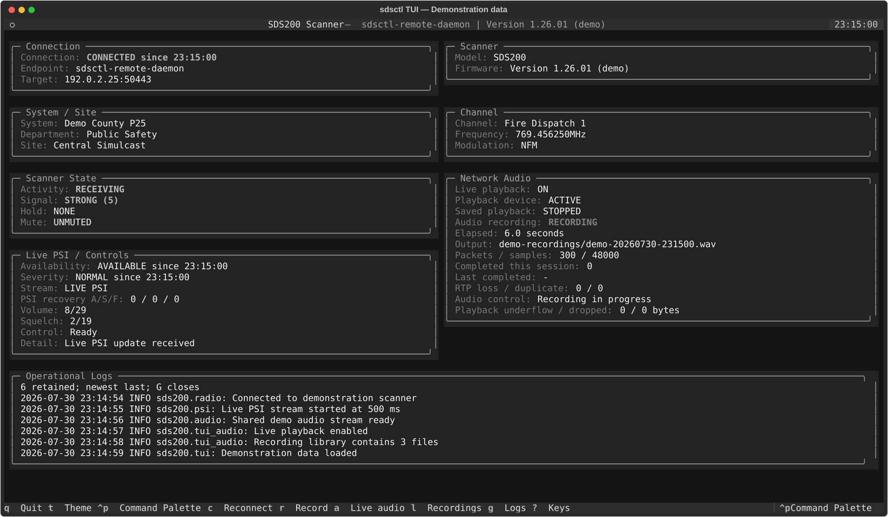

# sdsctl

<p align="center">
  
</p>

[](https://github.com/stevenboyd78/sdsctl/actions/workflows/ci.yml)


Python control and monitoring library for the **Uniden SDS100, SDS150, and
SDS200** scanners. All three models support USB serial control; the SDS200 also
supports native Ethernet control.

The project provides a typed Python API and an `sdsctl` command-line tool for
scanner discovery, status monitoring, commands, connection profiles, diagnostics,
and live state updates.

> [!IMPORTANT]
> This project is alpha software. The public API may change before version 1.0.
> It is not affiliated with or endorsed by Uniden.

## Interface preview



*The current Textual TUI rendered by the real application with fictional
demonstration data. No scanner, agency, channel, endpoint, or recording
information in this image represents a real system.*

## Features

- USB serial control for SDS100, SDS150, and SDS200 scanners
- Native SDS200 Ethernet control over UDP
- Model detection, aliases, capability reporting, and model-specific limits
- Model-aware handheld battery reporting: optional SDS100 GSI telemetry and SDS150 GCS charge status
- Automatic USB and bounded LAN discovery
- Saved serial, network, and automatic fallback profiles
- Preferred transport ordering with live USB/Ethernet failover and opt-in recovery
- Typed commands and responses, including documented hold/next/previous navigation
- Structured `GSI` and continuous `PSI` scanner information
- Thread-safe synchronized radio state and change events
- Live terminal monitoring
- Optional responsive [Textual full-screen TUI](docs/tui.md) for Raspberry Pi and
  terminal use with non-blocking scanner and SDS200 audio-recording controls
- Optional local [Favorites Workspace editor](docs/favorites-workspace-editor.md)
  with immutable in-memory edits, exact review/confirmation, and verified
  copied-tree or freshly qualified Linux USB execution
- Exponential reconnect backoff with configurable retry limits
- Traffic tracing, replayable JSON Lines session capture, and deterministic replay
- Bounded health history plus failover and preferred-recovery diagnostics
- Configurable operational logging to stderr, journald, or a logrotate-managed file
- Proactive in-place renewal of active SDS200 network PSI pushes before the
  finite push lifetime observed on physical firmware 1.26.01, serialized with
  scanner commands so renewal does not disturb request/response traffic
- Automatic rate-limited recovery from connected-but-silent PSI streams in
  both the Textual TUI and foreground daemon ownership runtime
- JSON Lines events for connection, retry, failover, and state changes
- Discovery-based repair for stale USB paths and scanner IP addresses
- Hardware-validated SDS200 network audio over RTSP/RTP
- Native G.711 mu-law decoding with independently buffered PCM destinations
- Versioned Broadcastify destination profiles with environment-backed secret
  references and validated adapter conversion
- Optional renderer-neutral live stream metadata with newest-value buffering,
  duplicate suppression, rate limiting, and Broadcastify-compatible alpha-tag
  updates isolated from PSI and PCM delivery
- Renderer-neutral audio encoder process lifecycle with immutable commands,
  bounded shutdown, stderr diagnostics, and injectable process factories
- Pluggable local playback with bounded newest-audio buffering, preserved
  PortAudio behavior, and explicit PipeWire, PulseAudio, and ALSA adapters
- Per-subscriber PCM health snapshots, ordered transitions, lifecycle metrics,
  redacted errors, and isolated startup, submission, and shutdown failures
- Renderer-neutral single-owner runtime for scanner control, PSI, one RTSP/RTP
  fanout, dynamic PCM destinations, immutable snapshots, and deterministic cleanup
- Versioned local daemon API over a private Unix-domain socket with
  backward-compatible snapshots, capability-checked scanner controls, strict
  JSON Lines envelopes, bounded clients, and deterministic shutdown
- Versioned ordered local daemon event stream over a separate private Unix
  socket with authoritative snapshots, bounded subscriptions, and explicit
  sequence-gap resynchronization
- Optional daemon-owned MQTT publication with retained availability, canonical
  semantic state topics, non-retained ordered semantic events, bounded reconnect
  backoff, packet-rate PSI suppression, Home Assistant MQTT device Discovery,
  and a bounded dedicated Home Assistant control adapter without opening another
  scanner session
- Explicit `sdsctl daemon-client` workflows for negotiated status and snapshot
  reads, safe typed scanner controls, validated gap-detecting event watches, and
  daemon-owned PCMU playback or WAV recording, plus bounded validated waterfall
  diagnostics
- Optional default-loopback daemon-backed HTTP service with a separate explicit
  password-authenticated native-TLS LAN mode, versioned health, status,
  snapshot, typed scanner-control, and OpenAPI endpoints, self-hosted Swagger UI
  and ReDoc, and redacted daemon failures without third-party browser asset
  requests
- Home Assistant App packaging that supervises the existing daemon and dashboard,
  uses Supervisor MQTT service discovery and authenticated Ingress, stores
  recordings in configurable Home Assistant media storage, and publishes a fixed
  UDP RTP port without enabling host networking or creating another scanner owner
- Versioned bounded local daemon PCMU stream over a third private Unix socket with
  accepted RTP payloads, continuity metadata, and independent client-loss counters
- Optional live playback through the local default or selected audio output device
- Simultaneous local playback and streaming PCM WAV recording from one RTSP session
- UDP XML fragment validation, statistics, and bounded retries
- Bash and Zsh tab completion
- Strict MyPy typing, Ruff checks, and hardware-independent tests

Network audio remains independent from scanner control, so playback and recording
do not open or affect the USB serial or UDP control transport. See the
[project roadmap](ROADMAP.md) for ordered work and the
[project vision](docs/project-vision.md) for broader deferred capabilities.

## Requirements

- Python 3.11 or newer
- A Uniden SDS100, SDS150, or SDS200
- For USB: scanner connected as a serial device
- For Linux desktop USB access, see the optional [udev rule](docs/udev.md)
- For Ethernet: scanner and computer on a trusted local network

Linux USB, Ethernet control, and RTSP/RTP audio recording have been validated
with an SDS200 running firmware version 1.26.01. SDS100 USB control has also been
validated on firmware 1.26.01. SDS150 support follows Uniden's shared SDS-series
remote-command specification and still needs physical-hardware validation.
Explicit SDS200 network hosts work on any platform supported by Python's TCP and
UDP sockets. Automatic route detection and `/dev/serial/by-id` discovery are
Linux-specific.

## Installation

Install the published package from PyPI:

```bash
python -m pip install sds200
```

Install the optional full-screen TUI:

```bash
python -m pip install "sds200[tui]"
```

Install the optional web service (loopback-only by default):

```bash
python -m pip install "sds200[web]"
```

Install optional daemon MQTT support:

```bash
python -m pip install "sds200[mqtt]"
```

The MQTT extra installs Paho MQTT 2.x. Generic daemon MQTT scanner commands
remain explicitly opt-in and reuse the daemon's existing control API rather than
raw scanner keys. Home Assistant MQTT Discovery is also disabled by default. When
Discovery is enabled, `controls_enabled` separately opts into seven dedicated
QoS 0 non-retained Home Assistant control topics for four desired-state Hold
switches plus Previous Channel, Next Channel, and Reconnect Scanner. Those Home
Assistant actions still dispatch through the existing typed daemon-control
boundary and do not require the generic MQTT request-envelope command topic.

Install optional local audio playback support:

```bash
python -m pip install "sds200[playback]"
```

On Linux, the Python extra requires the operating system's PortAudio runtime.
Install it on Debian or Raspberry Pi OS before starting playback:

```bash
sudo apt update
sudo apt install libportaudio2
```

Inspect the PortAudio build, host APIs, default output, and output-capable devices:

```bash
sdsctl audio-devices
```

Depending on the operating-system audio stack and PortAudio build, Linux devices
may be exposed through ALSA, PipeWire compatibility, PulseAudio compatibility, or
JACK. The CLI and TUI continue to use PortAudio by default. Python integrations can
instead construct a `BufferedPlaybackSink` with `PipeWirePlaybackAdapter`,
`PulseAudioPlaybackAdapter`, or `AlsaPlaybackAdapter`; the corresponding `pw-cat`,
`pacat`, or `aplay` executable must be installed.

Install the TUI with live and saved-recording playback:

```bash
python -m pip install "sds200[tui,playback]"
```

Install from source for development:

```bash
git clone https://github.com/stevenboyd78/sdsctl.git
cd sdsctl
python3 -m venv .venv
source .venv/bin/activate
python -m pip install --upgrade pip
```

For development:

```bash
python -m pip install -e ".[dev]"
```

## Quick start

### Find connected scanners

Search USB and directly connected IPv4 networks:

```bash
sdsctl discover
```

Search a specific network:

```bash
sdsctl discover --network 192.168.0.0/24 --network-only
```

Active LAN discovery sends the read-only `MDL` command to each usable host.
Only scan networks you own or are authorized to probe.

### USB serial

Show scanner information using automatic model detection:

```bash
sdsctl info
```

Select a specific model when multiple USB scanners are connected:

```bash
sdsctl --model SDS100 info
sdsctl --model SDS150 info
```

Start the live monitor:

```bash
sdsctl monitor
```

Launch the optional Textual interface:

```bash
sdsctl tui
```

Press `Q` to quit, `T` to switch semantic palettes, `C` to reconnect, `G` to
show or hide the operational log panel, and `?` for the full keyboard reference.
The TUI provides non-blocking scanner controls, responsive compact, standard,
and wide layouts, dense short-screen audio and PSI summaries, live and saved
SDS200 audio playback, repeatable recordings, mode-aware special-screen panels,
operational logging, and rate-limited stale-PSI recovery through USB, network,
profile, and replay selectors. A sustained stale PSI stream is automatically
reconnected without stopping active network audio; see the
[Textual TUI guide](docs/tui.md). The existing dark and light terminal themes
are independently packaged under `sds200/themes/tui/<theme-name>/`; validated
manifests, complete semantic palettes, and theme-only Textual CSS preserve the
same `--theme` values and `T` toggle. Valid managed TUI packages can also be
selected by ID with `--theme`; pressing `T` from one returns to built-in dark.

### Managed third-party themes

Validate, inventory, install, replace, explicitly activate, and remove unpacked
local theme packages with the host-independent lifecycle commands:

```bash
sdsctl themes validate /absolute/path/to/themes/web/my-theme
sdsctl themes install /absolute/path/to/themes/web/my-theme
sdsctl themes list
sdsctl themes install --replace /absolute/path/to/themes/web/my-theme
sdsctl themes remove web my-theme --confirm web/my-theme
```

The default managed root is
`${XDG_CONFIG_HOME:-~/.config}/sdsctl/themes/<interface>/<theme-name>/` for the
existing `web`, `home-assistant`, and `tui` interfaces. Home Assistant packages
contain executable browser JavaScript and additionally require
`--trust-home-assistant-code` during install or replacement. The lifecycle
automatically inventories valid and malformed packages independently. Valid
managed web themes are automatically available to a newly started `sdsctl web`
process and load only when selected in its existing browser-local picker.
Valid managed TUI palettes are available to Rich `scanner-info` and Textual on
the next command start when selected by ID. Managed Home Assistant packages stay
inactive until their exact digest is explicitly approved and deployed to an
operator-selected `www/sds200` directory; resource registration remains manual.
See
[Theme package management](docs/themes.md) for the package-author contract,
recovery behavior, activation details, JSON output, and trust boundaries.

### Favorites Workspace editor

Open one explicit offline copied Favorites directory in the optional local
Textual editor:

```bash
sdsctl favorites edit --copied-tree /absolute/path/to/favorites_lists
```

Or, on Linux, freshly qualify one explicitly mounted scanner USB target:

```bash
sdsctl favorites edit --usb /absolute/path/to/scanner-mount
```

Browsing, search, diagnostics, provenance, and raw detail are read-only. Edits
remain immutable and in memory until the exact write plan is reviewed and its
full token is supplied in a separate confirmation step. Execution uses only the
existing verified copied-tree or USB executor and displays backup, rollback,
report, recovery, and fresh-reload evidence. See the
[Favorites Workspace editor guide](docs/favorites-workspace-editor.md) for the
supported Name Tag and leaf operations, USB host-state boundary, and deliberate
non-goals.

With an explicit SDS200 network host, opt in to WAV recording and use `R` to start
or stop the one-shot recording session:

```bash
sdsctl --host 192.168.0.251 tui \
  --audio-output scanner-audio.wav
```

Use an explicit port when automatic discovery is not appropriate:

```bash
sdsctl \
  --port /dev/serial/by-id/usb-UNIDEN_AMERICA_CORP._SDS200_Serial_Port-if00 \
  info
```

### SDS200 Ethernet

```bash
sdsctl --host 192.168.0.251 info
sdsctl --host 192.168.0.251 scanner-info
sdsctl --host 192.168.0.251 monitor
```

The SDS200 virtual serial service uses UDP port `50536` by default.

### Foreground SDS200 daemon

Run one long-lived scanner-control, PSI, and network-audio ownership runtime in
the foreground:

```bash
sdsctl --log-level INFO --host 192.168.0.251 daemon
```

A saved network or fallback SDS200 profile may supply the endpoint:

```bash
sdsctl --log-level INFO --profile home daemon
```

The process owns one scanner control session, one PSI stream, one SDS200
RTSP/RTP session, and one decoded-PCM router. A fallback profile may use serial
control while its configured network host remains the audio endpoint.

For a directly owned SDS200 UDP control transport, the daemon also treats every
successfully parsed PSI frame as a liveness observation. Automatic recovery is
enabled by default after 10 seconds without PSI, with a 60-second minimum delay
between recovery attempts. Configure the policy with `--no-psi-auto-recover`,
`--psi-recover-after SECONDS`, and `--psi-recovery-cooldown SECONDS`. Recovery
uses the same nonblocking scanner-mutation slot as API and browser controls, so
an in-flight control defers the watchdog without consuming its cooldown. The
bounded reconnect reopens only scanner control/PSI; the independent RTSP/RTP
audio path remains running.

The daemon exposes five versioned local services through private Unix-domain
sockets:

- `$XDG_RUNTIME_DIR/sdsctl/daemon.sock`, or the user-state fallback, provides the
  request-response API for authoritative snapshots and safe typed scanner
  controls. Select an explicit absolute path with `--socket-path`.
- `$XDG_RUNTIME_DIR/sdsctl/events.sock`, or the user-state fallback, provides the
  ordered JSON Lines event stream. Select an explicit absolute path with
  `--event-socket-path`.
- `$XDG_RUNTIME_DIR/sdsctl/pcmu.sock`, or the user-state fallback, provides
  accepted RTP PCMU packets through a bounded binary stream. Select an explicit
  absolute path with `--pcmu-socket-path`.
- `$XDG_RUNTIME_DIR/sdsctl/recordings.sock`, or the user-state fallback, provides
  bounded read access to finalized inventory-approved WAV files for daemon
  clients such as the web dashboard. Select an explicit absolute path with
  `--recording-file-socket-path`.
- `$XDG_RUNTIME_DIR/sdsctl/waterfall.sock`, or the user-state fallback, provides
  a demand-driven, size-bounded JSON Lines stream of qualified GST/PWF/GWF
  records. Select an explicit absolute path with `--waterfall-socket-path`.

Use the explicit daemon client when another process owns the scanner:

```bash
sdsctl daemon-client status
sdsctl daemon-client snapshot
sdsctl daemon-client hold TGID 12345
sdsctl daemon-client hold-state channel off
sdsctl daemon-client volume 10
sdsctl daemon-client squelch 2
sdsctl daemon-client next TGID 12345 --count 1
sdsctl daemon-client reconnect
sdsctl daemon-client events --count 10 --json
sdsctl daemon-client waterfall --duration 10 --count 100 --json
sdsctl daemon-client audio --play
sdsctl daemon-client audio \
  --output scanner-audio.wav \
  --duration 30
sdsctl tui --daemon-client
sdsctl tui --daemon-client \
  --audio-playback \
  --audio-directory ~/recordings
```

API options such as `--socket-path` precede the client action. Event watching,
waterfall diagnostics, and audio use their separate `--event-socket-path`,
`--waterfall-socket-path`, and `--pcmu-socket-path` options after the
corresponding action. The top-level scanner commands remain the explicit
standalone workflows. Volume and squelch setters are
specification-backed and fixture-tested, but physical SDS200 firmware 1.26.01
testing found that UDP `VOL`/`SQL` writes timed out without mutation. Treat those
two LAN controls as unaccepted until the transport boundary is resolved; hold
state is physically accepted over the same direct and daemon-owned paths.

Every event client first receives an authoritative runtime snapshot at the
current global sequence boundary, then only later runtime, scanner, PSI,
radio-state, audio-lifecycle, and destination-health events. Sequence gaps show
that an event subscriber overflowed; reconnect to obtain a new authoritative
snapshot.

Every PCMU client receives only packets accepted after its independent
subscription is created. Frames preserve RTP sequence, timestamp, SSRC,
continuity estimates, observation time, endpoint, raw payload bytes, and
cumulative loss caused by that client's bounded queue.

Stop the process with `Ctrl+C` or `SIGTERM`. Shutdown closes API clients first,
then closes finalized-recording readers, finalizes any active daemon-owned
recording, stops configured destinations, attempts retained MQTT `offline` when
possible and stops the optional MQTT worker, stops scanner/PSI/audio/router
ownership, closes PCMU clients, and finally closes event clients after final
lifecycle transitions.
All four owned sockets are removed.

The command remains in the foreground for service-manager ownership. It does not
fork, create a pidfile, install a service, expose TCP, accept unrestricted raw
scanner commands, or provide decoded-PCM client subscriptions. The local API
supports compatibility indexed `hold`, documented `next` and `previous`,
semantic desired-state `hold_state`, and bounded `reconnect` operations.
`hold_state` sets System, Department, Site, or Channel Hold explicitly instead of
exposing a raw scanner key. Reconnect is available only when the daemon directly
owns the SDS200 UDP control transport; fallback or serial control returns
`unsupported_operation`. The compatibility safe-control sequence was
physically validated while API, event, PSI, RTSP/RTP, decoded-audio, and PCMU
clients remained active, followed by clean controlled shutdown. Milestone 20.6
separately validated all four semantic hold scopes through the loopback web HTTP
boundary and a representative Channel release/re-hold through the browser UI
while daemon/web processes, PSI, and audio remained healthy.
The daemon-owned audio client has also been physically validated with
simultaneous default-device playback and WAV recording. It received 258
consecutive loss-free PCMU frames, finalized a 10.320-second 8 kHz mono WAV,
preserved API health, and shut down with all three sockets removed. Its bounded
local playback queue reported six overflows and 2,088 dropped PCM bytes without
underflow; the daemon PCMU stream itself remained loss-free.

The top-level scanner commands and direct scanner-audio commands remain
standalone. The TUI also remains standalone by default; add `--daemon-client` to
explicitly use a foreground daemon. In daemon mode, the TUI reads identity and
authoritative initial state from `daemon.sock`, follows ordered updates from
`events.sock`, delegates safe controls through the daemon API, and consumes
daemon-owned PCMU from `pcmu.sock` for live playback, recording, metadata, and
the saved-recording library. It does not open scanner hardware or a second
RTSP/RTP session. Closing the TUI closes only its local clients and leaves
daemon ownership running. Reconnect requests are delegated through the daemon
API. Direct TUI RTSP/RTP options are rejected in daemon mode.

This path was physically validated on August 5, 2026, with a physical SDS200.
The daemon-backed TUI rendered cleanly, followed live state, completed a safe
control, automatically started playback, toggled playback with `A`, and produced
a valid 53.120-second 8 kHz mono WAV with an adjacent metadata sidecar. Quitting
the TUI left scanner, PSI, audio, router, and daemon ownership healthy. A later
controlled `SIGTERM` removed `daemon.sock`, `events.sock`, and `pcmu.sock`.

The daemon loads the explicit `--destination-config` path or
`${XDG_CONFIG_HOME:-~/.config}/sdsctl/daemon-destinations.toml` before opening
scanner hardware. Saved playback, recording, and remote-profile destinations are
activated under daemon ownership. `SIGHUP` transactionally reloads that exact
manifest while preserving the previous committed set on failure.

Optional MQTT configuration is likewise validated before scanner construction.
Use `--mqtt-config PATH` or the default
`${XDG_CONFIG_HOME:-~/.config}/sdsctl/daemon-mqtt.toml`. When the file is absent,
the daemon does not load or require the external Paho MQTT package. When present,
the daemon publishes retained `online`/`offline` availability plus canonical
semantic state derived from the existing authoritative event stream. Packet-rate
`scanner.psi` events are never forwarded to MQTT. When
`commands_enabled = true`, the same worker subscribes to `<prefix>/commands`,
accepts only the daemon API's semantic scanner-control operations, and publishes
non-retained correlated responses to `<prefix>/responses`. Retained commands are
rejected, and recent request IDs are deduplicated within the daemon process.
When `[home_assistant].enabled = true`, the worker publishes Home Assistant MQTT
device Discovery from authoritative snapshots and republishes it for an exact
configured Home Assistant birth message. The ten existing state/diagnostic
components continue to reuse canonical daemon MQTT state. When
`[home_assistant].controls_enabled = true`, seven standard Home Assistant control
entities use dedicated QoS 0 non-retained topics: four desired-state Hold
switches plus Previous Channel, Next Channel, and Reconnect Scanner buttons. The
adapter generates fresh internal daemon request IDs and never binds Home
Assistant directly to the generic `<prefix>/commands` request envelope. Broker
failures remain isolated in the MQTT worker and use configured reconnect backoff
rather than interrupting scanner ownership. See the
[daemon MQTT guide](docs/daemon-mqtt.md) for the version 1 manifest, exact topic,
Discovery, entity, identity, command, retention, secrets, and security contracts.

Decoded-PCM subscriptions and automatic daemon selection remain follow-on work.
See the
[generic container deployment guide](docs/container-deployment.md),
[daemon deployment and upgrade guide](docs/daemon-deployment.md),
[daemon runtime and process guide](docs/daemon-runtime.md),
[local daemon API guide](docs/daemon-api.md),
[local daemon event stream guide](docs/daemon-events.md),
[local daemon PCMU stream guide](docs/daemon-pcmu.md), and
[operational logging](docs/logging.md).

The generic release workflow publishes amd64 and arm64 images for genuine
matching release tags. v0.21.0 established that publication path; the current
v0.22.0 immutable release image is `theboyd78/sdsctl:0.22.0`, and
`theboyd78/sdsctl:latest` tracks the newest successfully published release.
Prefer an exact version tag for reproducible deployment. Repository-root Compose
remains source-built with `build: .` and does not select the published image.

The same generic image contains the existing MQTT support and the web extra.
Compose provides both an opt-in, network-disabled daemon-client sidecar and an
opt-in, long-running `web-dashboard` service over the daemon's private Unix
sockets. Start the daemon first, then run clients on demand or explicitly start
the web profile/service; for example:

```bash
docker compose up --detach --build daemon
docker compose run --rm daemon-client status --json
docker compose run --rm daemon-client events --count 10 --json
docker compose --profile web up --detach --build web-dashboard
docker compose ps web-dashboard
docker compose logs web-dashboard
```

See the generic container deployment guide for the supported status, snapshot,
scanner-control, ordered-event, and web-dashboard workflows and their security
boundary. The web service mounts only `/run/sdsctl`, consumes the daemon's
private API, event, PCMU, and recording-file sockets, and never owns the scanner,
network control, RTSP/RTP session, or audio routing. Under the explicit
`--container-exposure` mode it binds `0.0.0.0:8000` inside its ordinary Docker
bridge network, while Compose publishes only
`127.0.0.1:${SDSCTL_WEB_PORT:-8000}:8000`. Open
`http://127.0.0.1:8000/` by default, or set `SDSCTL_WEB_PORT` to select a
different Docker-host loopback port; the container listener remains fixed at
8000. LAN and public clients cannot reach this host-loopback publication by
default. The internal wildcard is safe only with that constraint: do not copy
`--container-exposure` into arbitrary LAN/public publication. The native
authenticated LAN mode is a separate host-process contract documented in the
web guide. The localhost `/healthz` probe checks only the web process. Do not use
host networking or Home Assistant Ingress mode for this generic Compose service;
Ingress remains a separate guarded security mode.

On native Linux Docker Engine, an opt-in standalone Compose file supports
one-shot USB serial scanner commands without privileged mode or networking:

```bash
export SDSCTL_USB_DEVICE=/dev/serial/by-id/usb-UNIDEN_AMERICA_CORP._SDS200_Serial_Port-if00
export SDSCTL_USB_GID="$(stat -Lc '%g' "$SDSCTL_USB_DEVICE")"
docker compose -f compose.usb.yaml run --rm usb-scanner info
```

The generic native-Linux container paths now include physical SDS200
firmware 1.26.01 acceptance for network daemon/client operation, the loopback web
sidecar, one-shot USB commands, and the persistent rootless Podman Compose USB
daemon. Device-lifecycle testing on 2026-08-21 covered unplug/replug,
`/dev/ttyACM*` re-enumeration, stale device mappings, ordinary Podman restart
rebinding, confirmed PSI readiness, and the scanner's post-attach
serial/mass-storage selection window. The validated USB path remains
unprivileged and maps only the selected scanner device.

Milestone 25.18 also establishes the container compatibility matrix. Rootless
Podman scanner-independent Compose config/build/run is accepted with Docker
Compose v5.4.0 and the tested alternate v5.5.0 provider, including through a
temporary Podman remote connection. Remote client-side USB is not supported:
Podman rejects `--group-add keep-groups` in remote mode, and this project does
not forward a client-attached scanner into a remote Podman service. Physical
Windows/macOS scanner acceptance and Docker Desktop USB/IP remain separate
non-claims.

See the [generic container deployment guide](docs/container-deployment.md)
for device preflight, lifecycle recovery, readiness semantics, Linux security
boundaries, and additional one-shot and persistent-daemon commands.

Serial-only profiles, replay captures, and non-SDS200 network-audio selections
are rejected.

### Web dashboard

Milestone 20.6 adds daemon-backed browser scanner controls for semantic
System, Department, Site, and Channel Hold/release, previous/next channel
navigation, and bounded reconnect on top of Milestone 20.5 daemon-owned
recording workflows, Milestone 20.4 explicit browser audio playback, and
Milestone 20.3 live same-origin Server-Sent Events.
The web service remains a daemon client: it does not open scanner hardware or a
second RTSP/RTP session. Start the foreground daemon, then run the web service in
another terminal:

```bash
sdsctl --log-level INFO --host 192.168.0.251 daemon
sdsctl web
```

Open `http://127.0.0.1:8000/` locally. Each browser stream receives an
authoritative daemon snapshot first and then strictly ordered state events.
Scanner connection, radio activity, PSI, audio, and daemon lifecycle changes
update incrementally. Two-second status polling remains active when live events
are unavailable, and a periodic authoritative status read reconciles the
browser with daemon state.

The activity panel presents the complete 35-field renderer-neutral radio state:
hierarchy names, indexes, and holds; channel identity; RF and service context;
talkgroup and unit identifiers; receiver levels; optional raw SDS100 battery
telemetry; signal, RSSI, P25, mute, and scanner-recording state; and Search,
Close Call, Weather/SAME, and Tone-Out details. Every authoritative update
replaces the complete browser projection so values from a previous screen are
cleared instead of leaking into a new mode. Literal `0` and false-like scanner
text remain visible; only absent values are shown as **Unavailable**. The raw
battery value has no host-inferred unit, percentage, range, or charging meaning.

Press **Play audio** to create one independent browser PCMU subscription. The
browser receives the daemon's validated PCMU v1 frames unchanged, decodes G.711
mu-law in an AudioWorklet, and reports packet totals plus daemon queue loss and
RTP loss. **Stop** closes only that browser audio subscription. Audio continues
while the dashboard is hidden, while closing or navigating away from the page
stops playback and releases the stream.

Press **Record** to attach a WAV sink to the daemon's already-owned decoded-PCM
router. The dashboard reports live recording duration, packet and sample totals,
and RTP reliability without creating another scanner audio stream. Active
recordings survive browser reloads and web-process disconnects. **Stop** finalizes
the WAV and adjacent metadata sidecar, refreshes the newest-first recording
inventory, and enables same-origin **Play** and **Download** actions for playable
completed recordings. Saved playback reads through the private daemon
recording-file service and does not create a browser PCMU subscription.

Browser hold buttons are desired-state controls. An unheld scope offers
**Hold system**, **Hold department**, **Hold site**, or **Hold channel**; an
authoritatively held scope offers the corresponding **Release** action and
retains its `Held` indicator. The browser sends only the semantic scope and
`held` boolean. The daemon performs the authoritative `GSI` read, executes the
verified SDS200 front-panel-key gesture when needed, and waits for the target
hold field to converge before returning success. The compatibility indexed
`scanner.hold` API remains available separately.

The interface retains keyboard focus, responsive compact behavior, reduced-motion
support, and text-only rendering of daemon values. The **Theme** selector offers
the system-adaptive dashboard plus immersive LCARS-inspired, Matrix-inspired,
First Responder, and Amateur Radio environments. On desktop-class viewports the
custom themes become dense full-screen workstations while preserving the same
accessible structure and semantic scanner state; smaller displays reflow into a
compact presentation instead of using a separate interface. The selection is
browser-local, is restored before the dashboard stylesheet paints, and does not
change daemon or scanner state. All five choices are independently packaged
under the interface-scoped `sds200/themes/web/<theme-name>/` hierarchy with a
validated versioned manifest and declarative stylesheet; the shared dashboard
layout contains no theme-owned selectors. The
[web dashboard guide](docs/web-dashboard.md#theme-gallery) includes generated
captures of every theme using deterministic fictional demo data.

Install it with `python -m pip install "sds200[web]"`. The service listens on
`127.0.0.1:8000` by default and accepts only `localhost` or explicit loopback IP
addresses. In default mode, wildcard, LAN, public, and non-local hostname
bindings are rejected.

An explicit direct-TLS mode supports password-authenticated access on one
specific private, unique-local, or link-local interface:

```bash
export SDSCTL_WEB_PASSWORD='replace-with-at-least-16-characters'
sdsctl web \
  --authenticated-lan \
  --lan-listen-address 192.168.1.25 \
  --listen-port 8443 \
  --lan-origin https://scanner.example:8443 \
  --lan-password-env SDSCTL_WEB_PASSWORD \
  --lan-tls-certfile /etc/sdsctl/dashboard-fullchain.pem \
  --lan-tls-keyfile /etc/sdsctl/dashboard.key
```

The mode rejects wildcard and public/global binds, requires a browser-trusted
certificate for the exact HTTPS origin, protects every dashboard route, and
does not trust proxy headers. Generic Compose and Home Assistant Ingress remain
separate mutually exclusive security modes. Reverse-proxy and public/Internet
exposure remain unsupported.

This mode was physically validated on August 22, 2026, against an SDS200 running
firmware 1.26.01. Two independent authenticated HTTPS sessions consumed SSE and
browser audio concurrently while exactly one daemon retained scanner UDP control
and the scanner's single RTSP/RTP audio session. A temporary recording survived
one session's logout, the other session continued receiving audio and downloaded
the finalized WAV, and web plus daemon shutdown completed without exposing the
temporary credential. See the guide for the complete bounded evidence.

See the [web dashboard guide](docs/web-dashboard.md).

### Home Assistant App

The Home Assistant App packages the existing foreground daemon and web dashboard
while preserving the daemon as the only scanner, PSI, and RTSP/RTP owner.
Supervisor supplies the configured MQTT service, the dashboard is presented
through authenticated Ingress, and recordings are stored in configurable Home
Assistant media storage, defaulting to `/media/sdsctl/recordings`.

For normal Home Assistant OS installation, add
`https://github.com/stevenboyd78/sdsctl` as a third-party App repository
from **Settings > Apps > App store > Repositories**, then install **sds200** from
that repository. Published releases use the versioned multi-architecture GHCR
image referenced by the committed App manifest. The `/addons` Local App workflow
is reserved for development and hardware testing.

The App requires an SDS200 LAN host and exposes only UDP port `50000` for the
scanner's inbound RTP audio. The daemon binds that fixed RTP port and Supervisor
maps host UDP `50000` to the container. Host networking is intentionally not
enabled. The daemon API, event, PCMU, and recording-file interfaces remain
private Unix-domain sockets inside the App.

The App configuration accepts the required `scanner_host`, optional
`mqtt_topic_prefix` defaulting to `sdsctl`, and optional media-relative
`recording_directory` defaulting to `sdsctl/recordings`. Home Assistant MQTT
Discovery is enabled by the App adapter and publishes twenty-four components:
seventeen state/diagnostic entities, including the fixed Screen Kind sensor and
optional Site, Frequency, Modulation, Service Type, and configured Tone-Out Tone
A and Tone B sensors,
plus System, Department, Site, and Channel Hold switches and Previous Channel,
Next Channel, and Reconnect Scanner buttons.
The App keeps the generic MQTT request-envelope command input disabled; the seven
Home Assistant controls use their own bounded translation layer over the existing
typed daemon-control boundary.

Browser audio continues to prefer AudioWorklet. When Home Assistant is opened
from a browser context where AudioWorklet is unavailable, the dashboard falls
back to a compatible Web Audio processor while preserving the same daemon-owned
PCMU stream.

The App installs the unchanged compact **SDS200 Scanner** Lovelace card plus an
additive **SDS200 Display** card. The display card offers five explicit
scanner-style layouts plus an opt-in automatic layout, three palettes, and a 4:3
viewport-fit option. Automatic mode uses the fixed Screen Kind entity to select
Search/Close Call, Weather, or Tone-Out presentation and a configured Simple or
Detail scanning fallback. Numeric zero configured for a Tone-Out tone is shown
as `Detect` while the entity retains the scanner text. Register both
`/local/sds200/sds200-card.js` and
`/local/sds200/sds200-display-card.js` as JavaScript Modules when using both
cards. Their byte-identical sources are independently packaged under
`sds200/themes/home-assistant/compact/` and
`sds200/themes/home-assistant/sds200-display/`; versioned manifests and one
validated immutable registry drive App installation without changing those
public URLs or enabling third-party discovery.

See the [Home Assistant App guide](docs/home-assistant-app.md) for architecture,
installation, configuration, networking, Ingress, local HAOS development,
persistent recordings, MQTT entities, security boundaries, and troubleshooting.

### SDS200 network audio playback and recording

Listen to the scanner through the operating system's default audio output:

```bash
sdsctl --host 192.168.0.251 audio --play
```

Record the scanner's RTSP/RTP audio directly to an 8 kHz mono signed 16-bit PCM
WAV file without requiring FFmpeg:

```bash
sdsctl --host 192.168.0.251 audio \
  --output scanner-audio.wav \
  --duration 30
```

Omit `--duration` to record until `Ctrl+C`. Existing files are protected unless
overwrite is explicitly enabled:

```bash
sdsctl --host 192.168.0.251 audio \
  --output scanner-audio.wav \
  --force
```

Playback and recording can share one RTSP/RTP session:

```bash
sdsctl --host 192.168.0.251 audio \
  --play \
  --output scanner-audio.wav
```

Use `--device DEVICE` to choose a PortAudio output device and `--buffer-ms` to
change the bounded playback queue. Playback underflow inserts silence; overflow
drops the oldest queued audio so the output remains live. The summary reports both
conditions and the number of dropped PCM bytes.

The scanner requires a nonstandard single RTP client port during RTSP `SETUP`.
The built-in transport handles that negotiation, receives payload type 0 PCMU,
decodes each accepted packet once, and fans the PCM out to independently buffered
destinations. WAV disk writes and local sound-device callbacks cannot block RTP
reception. The same long-lived fanout session powers TUI playback, repeatable
recording, and saved-recording controls without opening a second scanner stream.

Each recording summary reports estimated packet loss, duplicates, late and
malformed packets, and RTP timestamp discontinuities. A five-minute SDS200
hardware soak received 7,500 packets and 2,400,000 audio samples with every
reliability counter remaining at zero.

### Connection profiles and fallback

Create a profile directly from USB and LAN discovery:

```bash
sdsctl profile discover home \
  --network 192.168.0.0/24 \
  --prefer network
```

When both endpoints are found, the profile automatically falls back between
Ethernet and USB. The saved preference can be overridden for one command:

```bash
sdsctl --profile home --prefer serial monitor
```

Preferred recovery is disabled by default. Enable validated return to the saved
preferred endpoint when creating a fallback profile:

```bash
sdsctl profile discover home \
  --network 192.168.0.0/24 \
  --prefer network \
  --recover-preferred \
  --recovery-probe-interval 30 \
  --recovery-stability-window 5 \
  --recovery-cooldown 30
```

Override the saved recovery policy for one process:

```bash
sdsctl --profile home \
  --recover-preferred \
  --recovery-probe-interval 15 \
  monitor
```

Recovery opens the inactive preferred endpoint, sends `MDL`, verifies that an
SDS200 responds, waits through the stability window, probes again, and promotes
only while no request/response command is pending. Continuous PSI updates are
restarted after promotion.

Manual profiles remain supported, including explicit fallback profiles:

```bash
sdsctl profile add network-only --host 192.168.0.251
sdsctl profile add usb-only \
  --port /dev/serial/by-id/usb-UNIDEN_AMERICA_CORP._SDS200_Serial_Port-if00 \
  --model SDS200
sdsctl profile add handheld --port /dev/ttyACM0 --model SDS150
sdsctl profile add home \
  --port /dev/serial/by-id/usb-UNIDEN_AMERICA_CORP._SDS200_Serial_Port-if00 \
  --host 192.168.0.251 \
  --prefer network \
  --recover-preferred
```

Profiles are stored in `${XDG_CONFIG_HOME:-~/.config}/sds200/profiles.toml`.
This legacy connection-profile document remains separate from layered application
configuration, and `--config PATH` continues to override only this profile file.

### Layered application configuration

Optional application settings are loaded from `/etc/sdsctl/config.toml`,
`${XDG_CONFIG_HOME:-~/.config}/sdsctl/config.toml`, supported `SDSCTL_*`
environment variables, and explicit CLI options in that precedence order.
Missing files preserve the existing defaults and are never created automatically.

See [Layered application configuration](docs/configuration.md) for the versioned
TOML schema, supported fields, environment-variable names, path behavior,
validation rules, and Python provenance API.

Repair stale USB paths or a changed scanner IP address without losing the saved
transport preference:

```bash
sdsctl profile repair home --network 192.168.0.0/24
sdsctl profile repair home --network 192.168.0.0/24 --dry-run
```

### Reliability, health, and events

```bash
sdsctl --profile home health
sdsctl --profile home health --watch 5 --history
sdsctl --profile home health --watch 5 --history --json
sdsctl --profile home events --json
sdsctl --host 192.168.0.251 --trace scanner.trace monitor
```


Select an operational log level or append logs to a persistent file:

```bash
sdsctl --log-level INFO --host 192.168.0.251 monitor
sdsctl --log-level DEBUG --log-file /var/log/sdsctl.log \
  --host 192.168.0.251 events
```

`-v` selects `INFO`, `-vv` selects `DEBUG`, and an explicit `--log-level`
overrides verbosity. Raw scanner traffic remains separate under `--trace`.
See [Operational logging](docs/logging.md) for journald, permissions, and
logrotate examples.

Reconnects use capped exponential backoff. Retry forever by default, or set a
finite recovery budget:

```bash
sdsctl --profile home \
  --reconnect-attempts 8 \
  --reconnect-initial-delay 1 \
  --reconnect-multiplier 2 \
  --reconnect-max-delay 30 \
  monitor
```

`events --json` emits one JSON object per line for connection changes,
transport diagnostics, reconnect scheduling, failovers, preferred recoveries, and live state changes.

### Capabilities, capture, and replay

Show the connected model's limits and validation status:

```bash
sdsctl --model SDS100 capabilities
```

Record a replayable session and then run the same operation without hardware:

```bash
sdsctl --model SDS100 --capture sds100-info.jsonl info
sdsctl --replay sds100-info.jsonl --model SDS100 info
```

Captures can contain local scanner data. Use repeated `--redact TEXT` options and
inspect files before sharing them. See [Session capture and replay](docs/replay-and-capture.md).

### Typed navigation

The documented `HLD`, `NXT`, and `PRV` operations are available through
typed APIs and CLI commands:

```bash
sdsctl --model SDS100 hold SYS 100
sdsctl --model SDS100 next DEPT 200 100 --count 2
sdsctl --model SDS100 previous TGID 300
```

Targets and indexes are protocol values reported by GSI or GLT. The typed
navigation layer is specification-backed and replay-tested; smoke-test it on
the intended scanner before relying on it operationally. Prefer a replay fixture
when developing navigation logic without a scanner attached.

### Raw protocol commands

```bash
sdsctl command MDL
sdsctl command VER
sdsctl command GCS  # SDS150 charge status
sdsctl command VOL
sdsctl command SQL
sdsctl command STS
```

Raw command access is intended for documented scanner commands and protocol
development. Prefer the typed Python methods when they are available.

## Shell completion

Activate Bash completion for the current shell:

```bash
eval "$(sdsctl completion bash)"
```

Enable it whenever Bash starts:

```bash
echo 'eval "$(sdsctl completion bash)"' >> ~/.bashrc
```

For Zsh:

```zsh
eval "$(sdsctl completion zsh)"
```

## Python API

### USB

```python
from sds200 import SDSScanner

with SDSScanner.auto(model="SDS150") as radio:
    print(radio.get_model())
    print(radio.get_firmware())
    print(radio.get_volume())
    print(radio.get_squelch())
```

### SDS200 Ethernet

```python
from sds200 import SDSScanner

with SDSScanner.network("192.168.0.251") as radio:
    info = radio.get_scanner_info()
    print(info.system)
    print(info.department)
    print(info.channel)
    print(info.frequency)
```

### Continuous state updates

```python
from sds200 import SDSScanner

with SDSScanner.network("192.168.0.251") as radio:
    radio.on_state_change(
        lambda change: print(change.fields, change.current.channel)
    )

    with radio.scanner_info_push(interval_ms=500):
        radio.wait()
```

### Reconnect policy and health history

```python
from sds200 import ReconnectPolicy, SDSScanner

policy = ReconnectPolicy(
    initial_delay=1.0,
    multiplier=2.0,
    max_delay=30.0,
    max_attempts=8,
)

with SDSScanner.network("192.168.0.251", reconnect_policy=policy) as radio:
    print(radio.health_check().as_dict())
    print(radio.health_summary().as_dict())
```

### LAN discovery

```python
from sds200 import discover_network_scanners

for scanner in discover_network_scanners(["192.168.0.0/24"]):
    print(scanner.endpoint, scanner.model, scanner.latency_ms)
```

## Project naming

The user-facing product, repository, and executable are named `sdsctl`. New
application configuration, state, and cache paths use the `sdsctl` namespace.
The Python distribution and import package remain named `sds200`, while legacy
configuration remains compatible under the existing `sds200` configuration
root. Python applications should use
`SDSScanner`; the historical `SDS200` class name remains an alias.

## Security

The SDS200 network-control protocol is unauthenticated and unencrypted. Keep it
on a trusted LAN or access it through a secured VPN. Do not expose UDP port
`50536` directly to the public Internet.

This library is not a safety-critical or emergency-dispatch system. Do not rely
on it as the sole means of receiving urgent communications.

See [SECURITY.md](SECURITY.md) for vulnerability reporting and
[docs/transports.md](docs/transports.md) for transport limitations.

## Documentation

- [GitHub Wiki](https://github.com/stevenboyd78/sdsctl/wiki)
  — task-oriented installation, setup, and troubleshooting guides
- [Project roadmap](ROADMAP.md)
- [Supported scanner models](docs/supported-models.md)
- [Capability and field-parity audit](docs/capability-field-parity-audit.md)
- [Favorites Workspace editor](docs/favorites-workspace-editor.md)
- [Control transports](docs/transports.md)
- [LAN discovery and profiles](docs/discovery-and-profiles.md)
- [Layered application configuration](docs/configuration.md)
- [Fallback profiles](docs/fallback-profiles.md)
- [Reliability and observability](docs/reliability.md)
- [Operational logging](docs/logging.md)
- [Textual TUI](docs/tui.md)
- [Daemon deployment and upgrades](docs/daemon-deployment.md)
- [Foreground daemon and ownership runtime](docs/daemon-runtime.md)
- [Daemon MQTT publication](docs/daemon-mqtt.md)
- [Home Assistant App](docs/home-assistant-app.md)
- [Local daemon API](docs/daemon-api.md)
- [Web dashboard](docs/web-dashboard.md)
- [Local daemon event stream](docs/daemon-events.md)
- [Local daemon PCMU stream](docs/daemon-pcmu.md)
- [Audio subsystem architecture](docs/audio.md)
- [Acknowledgments](ACKNOWLEDGMENTS.md)
- [Contributing](CONTRIBUTING.md)
- [Support](SUPPORT.md)
- [Roadmap](ROADMAP.md)
- [Project vision](docs/project-vision.md)
- [Changelog](CHANGELOG.md)
- [Release process](docs/releasing.md)

## Development

```bash
python -m pip install -e ".[dev]"

ruff check .
mypy src/sds200
pytest
python scripts/check_docs.py
python -m build
python -m twine check dist/*
```

Tests must not require physical scanner hardware. Hardware validation is
documented separately in pull requests and release notes.

## Project status

Version `0.15.0` hardens the optional Textual workstation interface for sustained
Raspberry Pi operation. It adds configurable operational logging, automatic
rate-limited recovery from a connected-but-stale PSI stream, and deterministic
fault-injection coverage for audio startup, shutdown, repeated requests, and
scanner reconnects. Failed PSI reconnects preserve their requested update interval
so recovery continues after control traffic returns, while active SDS200 network
audio remains uninterrupted. SDS100 and SDS200 control support is
hardware-validated. SDS150 support is implemented and fixture-tested, but physical
validation is deferred until representative hardware is available. It does not
block unrelated releases. API compatibility is not guaranteed until version 1.0.

See [CHANGELOG.md](CHANGELOG.md) for development history,
[ROADMAP.md](ROADMAP.md) for ordered work, and
[the project vision](docs/project-vision.md) for deferred capabilities and
architectural direction.

## Acknowledgments

This project is created and maintained by Steven Boyd, with substantial development
assistance from OpenAI's ChatGPT. AI-assisted contributions are reviewed and tested
by the maintainer before inclusion. See [ACKNOWLEDGMENTS.md](ACKNOWLEDGMENTS.md).

## License

MIT. See [LICENSE](LICENSE).
