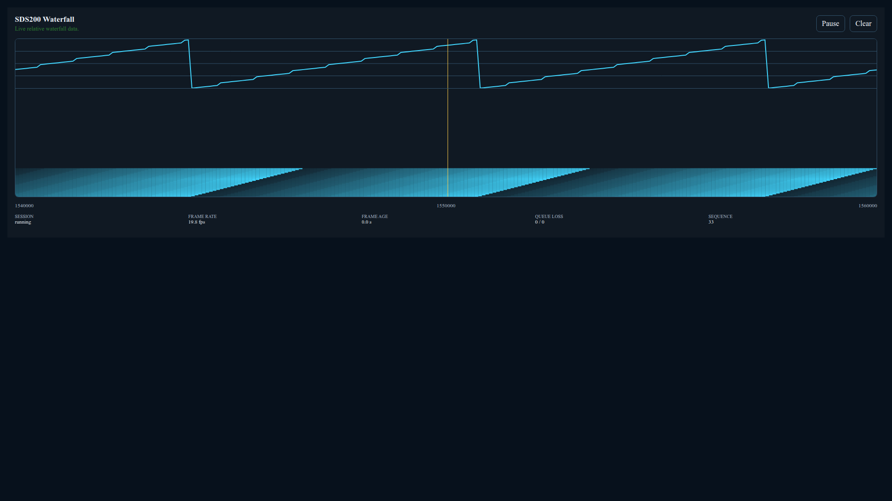
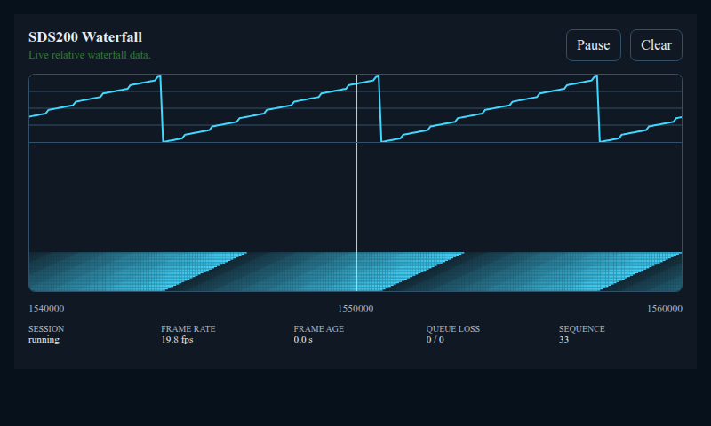
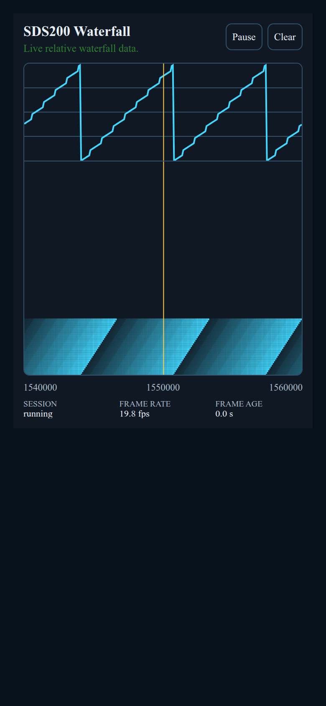

# Home Assistant App

Milestone 20.11 packages the existing `sdsctl daemon` ownership runtime and
daemon-backed web dashboard as one Home Assistant App. The App is an adapter and
process supervisor around those existing services; it does not create another
scanner control connection, PSI stream, RTSP/RTP session, recording owner, or
Home Assistant-specific scanner state machine.

## Architecture

The App starts two child processes:

1. the existing foreground `sdsctl daemon`, which remains the only scanner owner;
2. the existing `sdsctl web` service in explicit Home Assistant Ingress mode.

The App supervisor starts the daemon first, probes the private daemon API until it
is ready, and only then starts the web child. Failure of either child fails the
App and stops the sibling. Shutdown stops the web child before the daemon so
active browser streams close before daemon-owned recordings, audio, MQTT, and
scanner ownership are finalized.

Private runtime files live under `/run/sdsctl`:

- `daemon.sock`
- `events.sock`
- `pcmu.sock`
- `recordings.sock`
- `waterfall.sock`
- generated `daemon-mqtt.toml`

These remain container-private Unix-domain interfaces. The Home Assistant App
does not expose them as LAN TCP services.

## Requirements

The App requires:

- Home Assistant OS with Apps/Supervisor support;
- a LAN-connected Uniden SDS200 reachable from the Home Assistant host;
- an available Home Assistant MQTT service;
- host UDP port `50000` available for SDS200 RTP audio; and
- browser access to the Home Assistant frontend for Ingress.

Home Assistant OS is the physically validated release target. Other historical
or development Supervisor-based installation types are not part of the v0.20.0
release validation matrix.

The current Home Assistant MQTT adapter supports the non-TLS MQTT service shape
used by the tested deployment. If Supervisor reports the selected MQTT service
with TLS enabled, App startup rejects that service instead of silently weakening
or misconfiguring transport security.

## Configuration

The App exposes three options:

| Option | Required | Default | Meaning |
| --- | --- | --- | --- |
| `scanner_host` | yes | none | SDS200 LAN hostname or IPv4 address |
| `mqtt_topic_prefix` | no | `sdsctl` | Generic daemon MQTT topic root |
| `recording_directory` | no | `sdsctl/recordings` | Path below `/media` |

Home Assistant writes these values to `/data/options.json`. The App reads that
file at startup and converts the Supervisor MQTT service response into the
existing strict daemon MQTT configuration.

`recording_directory` is always interpreted relative to Home Assistant `/media`.
The default resolves to `/media/sdsctl/recordings`. Absolute paths, empty path
components, `.` and `..` traversal components, backslashes, and malformed values
are rejected before the daemon is started.

The MQTT password is never written into the generated TOML file. It is supplied
to the daemon through a dedicated environment variable. The Supervisor token is
used only by the App supervisor while resolving the MQTT service and is removed
from both daemon and web child environments.

Home Assistant Discovery is enabled by the App adapter. Semantic MQTT scanner
commands remain disabled.

## Networking

### Scanner RTP audio

SDS200 network audio is negotiated over RTSP, but the scanner sends RTP audio
back to a UDP port selected by the client. A container-local ephemeral port is
not sufficient because the physical scanner must be able to route packets back
through the Home Assistant host.

The App therefore fixes the daemon RTP receive port at UDP `50000`:

```text
sdsctl --host <scanner_host> daemon --rtp-bind-port 50000 ...
```

and publishes the same port through Supervisor:

```yaml
ports:
  50000/udp: 50000
ports_description:
  50000/udp: "SDS200 RTP audio"
```

No host network is required. If recording elapsed time advances but packet and
sample counters remain zero, verify that the App's Network configuration shows
UDP `50000`, that the port is not already in use, and that the scanner can route
UDP traffic to the Home Assistant host.

### Ingress

The web service listens on container port `8099` only for Home Assistant Ingress.
Ingress mode is explicit and separate from the normal standalone loopback mode.

The Ingress application guard admits only the actual Supervisor proxy peer
`172.30.32.2` and returns `403` to other peers. Uvicorn proxy-header processing
is disabled so an untrusted forwarded address cannot replace the real ASGI peer.

Home Assistant performs user authentication before forwarding the request. The
App does not publish the dashboard port directly to the LAN.
The standalone authenticated LAN mode is mutually exclusive with Ingress and is
not layered onto the App's Supervisor-authenticated request path.

Dashboard assets, API requests, Server-Sent Events, browser audio, scanner
controls, Swagger/ReDoc assets, saved recording playback, and recording downloads
derive their URLs from the active Ingress prefix rather than assuming `/`.

If an SSE response fails, including when an App restart temporarily produces a
terminal Ingress proxy response, the dashboard closes that EventSource and owns
one tracked two-second recreation timer for the same prefixed URL. Two-second
status polling remains active until the replacement EventSource opens, whose
first event supplies its authoritative snapshot. Hiding or leaving the page
cancels the pending retry so a later visibility restoration creates exactly one
stream.

Long-lived SSE and audio responses are compatible with Home Assistant Ingress
streaming.

## Browser audio

The preferred browser renderer is AudioWorklet. Some Home Assistant installations
are opened over a non-secure HTTP browser origin where the browser can construct
an `AudioContext` but does not expose `audioWorklet`.

The dashboard feature-detects that condition. When AudioWorklet is available it
uses the normal packaged `audio-worklet.js` renderer. Otherwise it falls back to
a script-driven Web Audio processor with the same G.711 mu-law decoding, bounded
buffering, gap insertion, and linear resampling behavior.

The browser still consumes the same daemon-owned PCMU stream in both cases.

## Persistent recordings

The App maps Home Assistant media storage read/write. Daemon-owned recordings are
stored under:

```text
/media/<recording_directory>
```

The default option therefore produces:

```text
/media/sdsctl/recordings
```

Finalized WAV files and adjacent metadata sidecars remain available after App
restart and can be managed through Home Assistant media storage. Samba or SSH
tools can also manage the files when those services expose `/media`.

On upgrade from v0.20.0, the App migrates the legacy `/data/recordings` tree into
the configured media library before starting the daemon. Migration preserves
nested relative paths and sidecars, preflights all destination collisions, and
never overwrites a differing file. Missing destinations are copied with metadata
and byte-verified before the source is removed. An identical destination is
treated as an already completed copy, allowing an interrupted migration to
resume safely.

Changing `recording_directory` later selects a different media library; it does
not implicitly move files between two already existing `/media` libraries.

The web dashboard lists finalized recordings through the existing private
recording-file service rather than opening arbitrary paths. Saved recordings can
be played or downloaded through Ingress.

## Home Assistant MQTT Discovery

The App enables the daemon's Home Assistant MQTT Discovery adapter plus the
dedicated Milestone 20.12.3 Home Assistant control adapter. One SDS200 device
contains twenty-four fixed components:

| Component | Home Assistant platform |
| --- | --- |
| Daemon State | sensor |
| Scanner Connection | binary sensor |
| Screen Kind | sensor |
| System | sensor |
| Department | sensor |
| Site | sensor |
| Channel | sensor |
| Frequency | sensor |
| Modulation | sensor |
| Service Type | sensor |
| Tone-Out Tone A | sensor |
| Tone-Out Tone B | sensor |
| Signal | sensor |
| RSSI | sensor |
| Audio | binary sensor |
| Recording | binary sensor |
| Recording Status | sensor |
| System Hold | switch |
| Department Hold | switch |
| Site Hold | switch |
| Channel Hold | switch |
| Previous Channel | button |
| Next Channel | button |
| Reconnect Scanner | button |

Device metadata includes Uniden as manufacturer plus scanner model and firmware
when the daemon's authoritative snapshot contains them.

Screen Kind is a fixed read-only sensor over the canonical radio-state topic. It
reports `unknown` when `screen_kind` is missing, null, or empty and remains
available across mode changes. Site, Frequency, Modulation, Service Type, and
configured Tone-Out Tone A and
Tone B use the existing generic radio-state topic. Each sensor is unavailable
when its nullable field is absent, null, or empty for the current scanner mode,
so a prior value is not presented as current. The component inventory remains
fixed; mode changes do not create or remove discovery components. Tone-Out
values are scanner configuration, not detected search or Close Call `SAD`.

The App keeps the generic daemon MQTT request-envelope command transport
disabled. Home Assistant controls instead use seven exact dedicated QoS 0,
non-retained topics below:

```text
<mqtt_topic_prefix>/home_assistant/control/
```

The four Hold switches publish `ON` or `OFF` and are non-optimistic. Their state
comes from the authoritative daemon radio-state topic, so a rejected command
does not falsely change the switch. A Hold switch is available only when the
daemon is online, the scanner is connected, and the corresponding hold state is
currently meaningful.

Previous Channel and Next Channel publish `PRESS`. They are available only for a
current trunked `TGID` or conventional `ConvFrequency` channel with a valid SDS200
channel index. The adapter reuses the existing bounded current-channel semantic
resolver and translates the action to `scanner.previous` or `scanner.next`. Its
navigation context comes only from the latest ordered daemon radio state and is
cleared on scanner disconnect or event-stream resynchronization until a fresh
authoritative state arrives.

Reconnect Scanner publishes `PRESS` to the dedicated reconnect topic. The daemon
retains the existing capability check, so unsupported transports still reject
the semantic `scanner.reconnect` operation.

Home Assistant never supplies a daemon request ID. The adapter creates a fresh
internal request ID for every accepted action and dispatches through the existing
typed daemon-control boundary. It does not expose raw scanner keys, publish to
the generic `<mqtt_topic_prefix>/commands` topic, create a response topic, or
open another scanner/control session.

The two entity-based Lovelace cards remain read-only and transport-free. Scanner
controls are standard Home Assistant switch and button entities rather than
direct card, App HTTP, scanner, or MQTT calls. The separate waterfall card uses
only authenticated Home Assistant frontend and App Ingress APIs; it never sends
scanner controls.

## Installation from the Home Assistant App repository

For a normal published installation:

1. open **Settings > Apps** in Home Assistant;
2. open **App store**;
3. open the top-right three-dot menu and choose **Repositories**;
4. add `https://github.com/stevenboyd78/sdsctl`;
5. open the new repository and select **sds200**;
6. install the App;
7. configure `scanner_host` and, if needed, `mqtt_topic_prefix` or
   `recording_directory`;
8. start the App and open **Web UI**.

Published releases use the image configured in
`home-assistant/sds200/config.yaml`. The App version and package version match
the release tag, and the release workflow publishes amd64 and aarch64 images
plus the generic multi-architecture GHCR image.

The repository installation path is the normal distribution mechanism.
Copying files into `/addons` is not required for a published release.

## Local HAOS development

For development against physical hardware, Home Assistant supports local Apps
under `/addons/<slug>`. The repository Dockerfile requires the project source
context, so create a staging directory containing the App manifest/Dockerfile
plus the Python project files:

```bash
STAGE="${HOME}/sds200-ha-app-dev"

rm -rf "${STAGE}"
mkdir -p "${STAGE}"

cp home-assistant/sds200/Dockerfile "${STAGE}/"
cp home-assistant/sds200/config.yaml "${STAGE}/"
cp .dockerignore pyproject.toml README.md LICENSE "${STAGE}/"
cp -a src "${STAGE}/"

sed -i   's|^image: "ghcr.io/stevenboyd78/sds200-home-assistant"$|# image: "ghcr.io/stevenboyd78/sds200-home-assistant"|'   "${STAGE}/config.yaml"
```

Copy that staged directory to `/addons/sds200` through the Home Assistant Samba
or SSH App, refresh the Local Apps repository, then install/rebuild the local
`sds200` App. Commenting out `image:` is development-only; the committed
production manifest retains the GHCR image reference.

Python bytecode is excluded from App build contexts through `.dockerignore`.

Useful Home Assistant developer references:

- https://developers.home-assistant.io/docs/apps/configuration/
- https://developers.home-assistant.io/docs/apps/testing/
- https://developers.home-assistant.io/docs/apps/presentation/
- https://developers.home-assistant.io/docs/apps/security/

## Operation

After installation:

1. set `scanner_host`;
2. leave `mqtt_topic_prefix` at `sdsctl` unless a different namespace is needed;
3. leave `recording_directory` at `sdsctl/recordings` unless another Home
   Assistant media subdirectory is preferred;
4. start the App;
5. open **Web UI**;
6. confirm live scanner state;
7. exercise browser audio or recording as needed.

Normal routine startup is intentionally quiet. App stdout/stderr is available
from the Home Assistant App Logs tab when a failure occurs.

## Live scanner audio media source

Milestone 29.2 packages a separate versioned Home Assistant custom integration
that exposes `media-source://sdsctl/live`. The App does not install, activate,
reload, restart, update, or remove that integration during normal startup. See
[the live-audio integration guide](home-assistant-live-audio.md) for its exact
MP3 representation, private Core-to-App capability boundary, deliberate
Ingress-only digest-confirmed install/update/rollback/removal actions, App DNS
identity rules, automation syntax, target limitations, and test workflow.

## Bundled Lovelace cards

The Home Assistant App installs three first-party SDS200 cards and one
declarative aggregate entry point:

```text
/homeassistant/www/sds200/sds200-card.js
/homeassistant/www/sds200/sds200-display-card.js
/homeassistant/www/sds200/sds200-waterfall-card.js
/homeassistant/www/sds200/sds200-cards.js
```

Home Assistant serves them to the frontend as:

```text
/local/sds200/sds200-card.js?v=beb1c6f22d62655caf4fc541a0cabfa4ed273b8fe22d6b3fe4324f5dc88ab9d8
/local/sds200/sds200-display-card.js?v=b2d47c2b7abd19a92b2ee61b6b3de00362366f8df828d7786c54ae35aa0ada72
/local/sds200/sds200-waterfall-card.js?v=87bc2be613a2c44a185c32780ea7fd0c65b0d3e6c642d8d3c8a547bfcc250030
/local/sds200/sds200-cards.js?v=543b8d2fa1d257c64ee343f5880f330a18bc4e254ad8d11523450e296b5322a1
```

The `v` value is the exact SHA-256 of the installed JavaScript module. Home
Assistant serves `/local` resources with a long public cache lifetime, and HTTP
and HTTPS browser origins maintain independent caches. The content-addressed
query prevents one origin from continuing to execute an older card after an
App update. Register the complete manifest-declared URL, including `?v=...`,
and replace that resource URL whenever the packaged digest changes. The
underlying filename remains stable; the query contains no credential or private
host information. The value is a content digest, not an operator-selected or
custom version string.

Milestone 29.2 physical acceptance replaced all three legacy resource
registrations with their exact manifest-declared URLs. The same dashboard then
rendered seven SDS200 display cards over both the direct HTTP origin and the
external HTTPS origin with no configuration errors. In particular, the
previously stale HTTPS Auto Display card rendered `Auto / Detail` with its
configured `dracula` palette, proving that the digest-qualified URL separates a
new module revision from each origin's older cached bytes.

The byte-identical source modules are independently packaged inside the Python
distribution as:

```text
sds200/themes/home-assistant/compact/
sds200/themes/home-assistant/sds200-display/
sds200/themes/home-assistant/waterfall/
sds200/themes/home-assistant/sds200-cards.js
```

Each card package contains a versioned manifest and its one declared JavaScript
module. The top-level aggregate module contains only ordered imports of those
three manifest-declared digest-qualified URLs. A validated immutable built-in
registry supplies the installer order,
module source, custom-element identity, installed filename, and public resource
URL. Invalid or undeclared package content is rejected before installation.
This is a built-in packaging boundary. Managed third-party Home Assistant
packages require an explicit executable-code trust acknowledgement and separate
digest-confirmed activation. The App does not automatically discover, approve,
install, execute, or replace managed modules.

For a new installation, register only the complete aggregate
`/local/sds200/sds200-cards.js?v=543b8d2fa1d257c64ee343f5880f330a18bc4e254ad8d11523450e296b5322a1`
URL in **Settings > Dashboards > Resources** as a **JavaScript Module**. It
loads all three cards in deterministic manifest order. The three complete
individual URLs above remain supported when only selected cards are wanted and
for existing installations. Registering the aggregate beside an individual
module is safe but redundant; the guarded card and picker registrations remain
idempotent. HACS is not required. The original **SDS200 Scanner** card remains
read-only. The additive **SDS200 Display** card provides five
explicit layouts—Simple, Detail, Search/Close Call, Weather, and Tone-Out—plus
an opt-in Auto layout, and Color, Black on White, and White on Black palettes.
The **SDS200 Waterfall** card renders the App's authenticated relative,
uncalibrated spectrum stream with bounded rolling history. All three graphical
editors additionally expose the same 21 System web palettes. The selection is
stored per card, changes presentation only, and does not follow or alter the
web dashboard's browser-local palette choice.

If the App creates Home Assistant's `www` directory for the first time, restart
Home Assistant Core once before registering the resource so `/local` becomes
available.

To migrate an existing installation, add the aggregate URL first, reload the
Home Assistant frontend, and verify all three cards. The operator may then
remove the three individual resource records. Removing those records does not
remove dashboard cards or their configuration. The App never adds, updates, or
deletes resource records automatically.

The automatic `/local` delivery requires the App to map Home Assistant's
configuration directory read/write. That filesystem permission is broader than
the four installed JavaScript files: the container can technically write elsewhere in the Home
Assistant configuration tree while it is running. The SDS200 installer
deliberately limits its own behavior to creating `www/sds200` when necessary and
creating or replacing only the four files listed above. It does not edit
Home Assistant YAML, `.storage`, dashboards, or resource registration.

Failure to install or update the optional cards is isolated from the scanner
runtime. The App logs a warning and continues starting the daemon and web
dashboard.

The compact and display cards intentionally avoid calls to the App, daemon,
scanner, MQTT broker, or Home Assistant APIs. They subscribe only to Home
Assistant's supported `states` data context through the frontend
`context-request` mechanism. The waterfall card is also read-only, but uses
Home Assistant's authenticated frontend API context to create and validate an
Ingress session and then streams from the one running SDS200 App. It never opens
a scanner transport or publishes high-rate samples through MQTT.

After registering the resource, add **SDS200 Scanner** from the Home Assistant
card picker. The card uses Home Assistant's built-in graphical form editor.
Expand **SDS200 entities** and select the entities created by the SDS200 MQTT
Discovery device. Entity selectors are constrained to the expected `sensor` or
`binary_sensor` domain.

YAML configuration remains available as a fallback:

```yaml
type: custom:sds200-card
title: SDS200 Scanner
palette: theme  # Home Assistant theme or one System web palette
entities:
  scanner_connected: binary_sensor.REPLACE_ME
  system: sensor.REPLACE_ME
  department: sensor.REPLACE_ME
  site: sensor.REPLACE_ME
  channel: sensor.REPLACE_ME
  frequency: sensor.REPLACE_ME
  modulation: sensor.REPLACE_ME
  service_type: sensor.REPLACE_ME
  tone_out_tone_a: sensor.REPLACE_ME
  tone_out_tone_b: sensor.REPLACE_ME
  signal: sensor.REPLACE_ME
  rssi: sensor.REPLACE_ME
  audio_running: binary_sensor.REPLACE_ME
  recording_active: binary_sensor.REPLACE_ME
  recording_status: sensor.REPLACE_ME
  daemon_state: sensor.REPLACE_ME
```

Use the actual entity IDs created by the SDS200 MQTT Discovery device. The card
remains deliberately read-only. Milestone 20.12.3 scanner controls are separate
standard Home Assistant switch and button entities, so the card does not acquire
a scanner, daemon, MQTT, or Home Assistant service-call transport.

For the scanner-style presentation, add **SDS200 Display** from the picker and
configure the same sixteen display entities. To use automatic presentation,
also configure the Screen Kind entity. The graphical editor selects the layout,
automatic scanning fallback, palette, and fit mode. Equivalent YAML starts with:

```yaml
type: custom:sds200-display-card
title: SDS200 Display
layout: auto  # auto, simple, detail, search, weather, or tone_out
scan_layout: detail  # simple or detail when Auto is scanning or cannot classify
palette: color  # scanner preset or one System web palette
fit: viewport   # card or viewport
entities:
  scanner_connected: binary_sensor.REPLACE_ME
  screen_kind: sensor.REPLACE_ME
  system: sensor.REPLACE_ME
  department: sensor.REPLACE_ME
  site: sensor.REPLACE_ME
  channel: sensor.REPLACE_ME
  frequency: sensor.REPLACE_ME
  modulation: sensor.REPLACE_ME
  service_type: sensor.REPLACE_ME
  tone_out_tone_a: sensor.REPLACE_ME
  tone_out_tone_b: sensor.REPLACE_ME
  signal: sensor.REPLACE_ME
  rssi: sensor.REPLACE_ME
  audio_running: binary_sensor.REPLACE_ME
  recording_active: binary_sensor.REPLACE_ME
  recording_status: sensor.REPLACE_ME
  daemon_state: sensor.REPLACE_ME
```

Auto maps `search` and `close_call` to Search/Close Call, `weather` to Weather,
and `tone_out` to Tone-Out. `scanning`, `unknown`, unavailable, missing, and
future values use `scan_layout`. Explicit layouts ignore Screen Kind and retain
their existing behavior. Existing cards remain Simple by default unless Auto is
selected.

`card` fit fills the available Lovelace column while retaining a 4:3 surface.
`viewport` fit grows to the smaller width- or height-constrained size, centers
the surface, and keeps it within the dynamic viewport without internal scrolling.
Text truncates when necessary rather than changing the information grid. The
layouts are an original accessible presentation inspired by the information
hierarchy on pages 38–39 of the
[SDS200 Owner's Manual](https://www.uniden.info/download/ompdf/SDS200om.pdf);
they do not copy scanner artwork, branding, or fonts.

The compact card includes optional Tone A and Tone B detail rows, and the
`tone_out` display layout presents both configured values. Numeric zero with an
optional `Hz` suffix is displayed as `Detect`, matching the scanner's
tone-frequency detection configuration, while nonzero or unrecognized nonempty
scanner text is shown unchanged. The Home Assistant sensor retains the raw text.

For the live spectrum presentation, add **SDS200 Waterfall** from the picker.
It does not require entity IDs, a scanner address, an App slug, a private Ingress
identifier, a URL, or credentials in the card configuration. The graphical
editor exposes only bounded presentation choices. Equivalent YAML is:

```yaml
type: custom:sds200-waterfall-card
title: SDS200 Waterfall
density: standard  # compact, standard, or tall
palette: theme  # theme, Waterfall preset, or one System web palette
history: 120  # 60, 120, or 240 frames
show_scale: true
show_telemetry: true
start_paused: false
```

The card discovers the SDS200 panel through Home Assistant's frontend context,
asks Home Assistant for an authenticated App Ingress session, and requires
exactly one running SDS200 App. No App produces an unavailable state; multiple
running SDS200 Apps fail closed so the card cannot silently select the wrong
scanner owner. Stop or uninstall obsolete Local Apps before using it.

Each connected and visible card owns its own demand lease over the daemon's one
shared waterfall session. Hidden, removed, or disconnected cards abort their
streams. The last released lease stops scanner-side waterfall demand. **Pause**
freezes visual history while retaining the live lease; **Clear** removes only
that card's retained history. History, input lines, reconnect delay, Canvas
dimensions, device-pixel scaling, queued repaint work, and frame count are
bounded. The stream is relative and uncalibrated; it is not a calibrated signal
level or measurement instrument.

Ingress authentication is shared between card instances, but stream leases and
presentation settings remain independent. Authentication expiry, an App restart,
or a transport interruption produces a visible bounded reconnect state. The card
requests Server-Sent Events so Home Assistant Ingress forwards each record
without NDJSON response buffering, while retaining validated NDJSON decoding for
direct compatibility. It expires its displayed frame-rate sample window even
when delivery pauses, so stale history cannot be presented as a current rate. It
does not store authentication material, Ingress identifiers, private endpoints,
or scanner addresses in configuration, browser storage, diagnostics, or logs.

### Waterfall card reference presentations

These deterministic Chrome captures use fictional spectrum and frequency data.
They contain no scanner address, credential, Home Assistant identity, private
Ingress value, or local programming information.

Desktop, 1920×1080 CSS pixels:



Raspberry Pi or wall panel, 800×480 CSS pixels:



Phone, 390×844 CSS pixels at DPR 2:



Regenerate all three through the same real-Chrome lifecycle audit:

```bash
node scripts/audit_web_dashboard_browser.mjs \
  --timeout-ms 30000 \
  --waterfall-screenshot-dir docs/assets/home-assistant
```

## Security boundary

The default App deliberately avoids `host_network`.

Only SDS200 RTP UDP `50000` is published. The web dashboard remains behind
authenticated Home Assistant Ingress, and the daemon API/event/PCMU/recording
interfaces remain private Unix-domain sockets.

Enabling host networking alone would not make remote `sdsctl daemon-client`, TUI,
or future GUI clients work because those clients currently consume Unix-domain
sockets rather than LAN TCP services. A network daemon-client transport,
authentication/access policy, and any optional host-network App variant belong
to a separate future security boundary.

The SDS200's own LAN protocols and the current non-TLS MQTT adapter are not
encrypted. The App keeps generic daemon MQTT commands disabled, but its seven
dedicated Home Assistant control topics still make authorized broker publishers
scanner-control principals through the bounded semantic adapter. Keep the
scanner, broker, Home Assistant host, and App on trusted networks and restrict
publish authority for the dedicated control namespace accordingly.

## Troubleshooting

### App does not appear after copying a local build

Refresh the Home Assistant page and the Local Apps repository. Supervisor must
reread `config.yaml` before newly added options or port mappings appear.

### Supervisor pulls an image instead of building local source

For local development only, comment out the `image:` line in the staged
`config.yaml`.

### Scanner state works but audio and recording stay at zero packets

Confirm the App Network configuration shows UDP `50000` mapped to host port
`50000`. The daemon can report its audio runtime as running after RTSP setup even
when no RTP datagrams are reaching the container.

### Browser audio remains on Buffering

First check whether a daemon-owned recording receives packets. If recording also
stays at zero packets, troubleshoot UDP `50000` before investigating Ingress.

If recording receives packets but live Browser Audio remains silent, verify
saved-recording playback and browser, tab, and system audio output before
changing the App. Live Browser Audio uses Web Audio while finalized recordings
use the browser's native media playback path. If browser audio output is healthy
but live packets still do not reach the renderer, investigate the
daemon-PCMU/web/Ingress stream path.

### Recordings are not visible through Samba or SSH

The default recording library is `/media/sdsctl/recordings`, not the legacy
`/data/recordings` path. A custom `recording_directory` is relative to `/media`.
Confirm the Samba or SSH service being used exposes Home Assistant media storage.

### MQTT service startup fails

Check the App Logs tab and the configured Home Assistant MQTT service. The
current App adapter rejects an MQTT service that requires TLS.

### MQTT device is missing

Confirm Home Assistant's MQTT integration is active and the App remains running.
The App publishes Discovery after an authoritative daemon snapshot and
republishes it after the configured Home Assistant birth message.

## Physical validation

Milestone 20.11 was validated on August 9, 2026, on Home Assistant OS with a
physical Uniden SDS200 running firmware 1.26.01.

The validation covered:

- local App discovery, build, installation, configuration, and startup;
- live scanner connection and ordered scanning updates through Ingress;
- Channel Hold and release through the browser control API;
- live browser audio through Ingress;
- UDP `50000` RTP delivery through the Supervisor container mapping;
- daemon-owned recording with advancing packet/sample telemetry;
- WAV finalization, inventory, and saved playback;
- recording persistence and playback across App stop/start;
- clean App restart with scanner and audio recovery; and
- all ten Home Assistant MQTT Discovery entities with correct SDS200 model and
  firmware metadata.

That evidence is the historical Milestone 20.11 baseline. The three post-v0.20.1
Home Assistant slices require one tagged repository-managed acceptance run before
v0.20.2 release completion.

### Post-v0.23.0 scoped Controls acceptance

On August 28, 2026, the redesigned Web Controls pane was validated through
authenticated Ingress on an amd64 Home Assistant OS 18.2 host running Core
2026.8.3, Supervisor 2026.07.5, and Docker 29.7.2 against an SDS200 running
firmware 1.26.01. An isolated Local App was built from reviewed source commit
`fe9fc91219c0dcab07e5379b74a1ecdb9df9f5e7`; the repository App remained stopped
during the bounded test so the scanner retained exactly one application owner.

The Controls pane visibly presented the current System, Department, Site, and
Channel, an explicit `Held` or `Not held` state, and Previous, Hold/Release, and
Next actions for every scope without viewport scrolling. The scanner accepted
Previous and Next for System, Department, and Site while their authoritative
targets remained unchanged under the existing held configuration. This proves
the scoped route, authoritative-index resolution, typed daemon dispatch, and
completion path for those observed conditions, but does not claim physical
alternate-item traversal at those three scopes.

For the Channel scope, a temporary hold stabilized Orem/Lindon Police 1.
Previous visibly selected Orem Police Car to Car, and Next restored Orem/Lindon
Police 1. The temporary Channel hold was then released. The Local App was
stopped, the repository-managed 0.23.0 App was restarted, and its authenticated
dashboard reported `Connected`; the repository App was therefore restored as
the sole scanner owner.

### v0.25.0 release acceptance gate

After the genuine v0.25.0 tag publishes the amd64, aarch64, and generic
multi-architecture images, upgrade or install the repository-managed App and
record the exact platform, App image, integration artifact, and scanner versions
used. The release gate must confirm:

- the App reports 0.25.0 and uses the matching published image without a Local
  App, Local integration, retained share, or development-source ambiguity;
- all twenty-four fixed MQTT Discovery components and all three first-party card
  modules load from their manifest-declared SHA-qualified resource URLs through
  both applicable dashboard origins;
- the responsive Waterfall card creates authenticated demand only while visible,
  renders explicitly relative and uncalibrated data, and releases final demand
  after removal, navigation, or disconnect;
- the optional Core integration reports version 0.1.5, browses
  `media-source://sdsctl/live`, resolves exact `audio/mpeg`, plays on a reachable
  representative media target, stops cleanly, and leaves zero active or
  outstanding playback leases;
- the selected target can reach Home Assistant's configured internal or external
  URL, while no App capability, Ingress identifier, scanner address, Supervisor
  token, or public audio listener is exposed;
- the Ingress-only Home Assistant workspace retains explicit digest confirmation,
  update/rollback/removal behavior, visible two-step destructive confirmation,
  bridge-key protection, Core-restart guidance, and reauthentication guidance;
- System palettes, all six managed web themes, controls, browser audio,
  recording and finalization, saved playback and download, waterfall, ordered-
  event recovery, persistent recordings, and App restart recovery remain healthy;
  and
- the repository-managed App remains the only runtime owner of scanner control,
  status polling, waterfall polling, and RTSP/RTP audio.

The release-validation integration and any deliberately named Local App must be
removed afterward. Restore the published App as sole owner, perform only the
documented Core restart or reload, verify preserved recordings, and retain no
private capability, recording, address, scanner-programming, or credential data
in public release evidence.

### v0.24.0 release acceptance gate

After the genuine v0.24.0 tag publishes the amd64, aarch64, and generic
multi-architecture App images, upgrade or install the repository-managed App and
record the exact platform and scanner versions used. The release gate must
confirm:

- the App reports 0.24.0 and uses the matching published image without a Local
  App or development-source ambiguity;
- all twenty-four fixed MQTT Discovery components, both bundled card modules,
  all six built-in themes, and the responsive six-pane workspace remain healthy;
- the Controls pane retains complete current System, Department, Site, and
  Channel context plus independent held-state text and Previous, desired-state
  Hold/Release, and Next actions for every scope;
- authenticated Waterfall demand and cleanup, semantic controls, browser audio,
  recording, finalized playback, downloads, ordered-event recovery, and
  persistent recordings retain their established behavior; and
- the repository-managed App remains the only runtime owner of scanner control,
  status polling, waterfall polling, and audio.

The local Favorites editor's credentialed RadioReference preview, planning, and
guarded execution workflow is not exposed through Home Assistant Ingress, MQTT,
or the App. No Home Assistant waterfall card or MQTT waterfall entity is part of
v0.24.0; those remain Milestone 29 work. Published-image acceptance remains
required even though the post-v0.23.0 scoped Controls development run passed.

### v0.23.0 release acceptance gate

After the genuine v0.23.0 tag publishes the amd64, aarch64, and generic
multi-architecture App images, upgrade or install the repository-managed App and
record the exact platform and scanner versions used. The release gate must
confirm:

- the App reports 0.23.0 and uses the matching published image without a Local
  App or development-source ambiguity;
- all twenty-four fixed MQTT Discovery components are present, including Screen
  Kind and the v0.22.0 field and Tone-Out sensors;
- all six built-in themes remain available through the responsive six-pane
  workspace, and Auto presentation follows scanning and special scanner modes;
- opening the authenticated Waterfall pane starts explicitly relative,
  uncalibrated data; its display controls remain responsive; and leaving the pane
  releases private daemon demand;
- the waterfall surface reports lifecycle and loss telemetry, recolors with theme
  changes, and recovers after an App restart;
- both bundled card modules, semantic controls, browser audio, recording,
  finalized playback, downloads, ordered-event recovery, and persistent
  recordings remain healthy; and
- the repository-managed App remains the only runtime owner of scanner control,
  status polling, waterfall polling, and audio.

No Home Assistant waterfall card or MQTT waterfall entity is part of v0.23.0.
Managed third-party Home Assistant theme activation remains an explicit host CLI
workflow, and the App must continue installing only its two bundled modules.

### v0.22.0 release acceptance contract

The v0.22.0 tagged repository-managed acceptance contract required the amd64,
aarch64, and generic multi-architecture App images plus exact platform and
scanner-version evidence. It required confirmation that:

- the App reports 0.22.0 and uses the matching published image without a Local
  App or development-source ambiguity;
- all twenty-three fixed MQTT Discovery components are present, including Site,
  Frequency, Modulation, Service Type, Tone-Out Tone A, and Tone-Out Tone B;
- both bundled JavaScript modules install at their established `/local/sds200/`
  URLs and the compact and responsive cards load through their graphical editors;
- the five responsive-card layouts, three palettes, Card fit, and viewport fit
  remain available, with the selected viewport layout fully visible without
  internal scrolling;
- System, Department, Site, and Channel Hold, Previous Channel, Next Channel,
  Reconnect Scanner, Ingress state, browser audio, recording, finalized playback,
  and downloads remain healthy;
- recordings and card resources persist across an App restart or upgrade; and
- the App remains the sole daemon, scanner-control, PSI, and RTSP/RTP owner.

Managed third-party Home Assistant theme activation remains an explicit host CLI
workflow. The App must continue installing only its two bundled modules and must
not scan or activate the managed XDG theme root automatically.

### v0.20.2 release acceptance

After the v0.20.2 tag publishes the amd64, aarch64, and generic
multi-architecture App images, validate the repository-managed App rather than a
previous Local App installation:

- confirm the App reports v0.20.2 and loads the matching documentation;
- confirm the 20.12.1 Configuration-page names and descriptions render for
  `scanner_host`, `mqtt_topic_prefix`, and `recording_directory`;
- confirm the recording-directory description identifies `/media` as its root
  and the default resolves to `/media/sdsctl/recordings`;
- confirm `/local/sds200/sds200-card.js` is installed and can be registered as a
  JavaScript Module;
- confirm **SDS200 Scanner** appears in the card picker, its graphical editor
  works, and the read-only card renders the selected Discovery state entities;
- confirm the SDS200 MQTT device exposes twenty-three total components;
- confirm Site, Frequency, Modulation, Service Type, and Tone-Out Tone A and
  Tone B become unavailable when the current radio state omits them and recover
  on the next applicable state;
- exercise System, Department, Site, and Channel Hold in both meaningful
  desired-state directions and confirm authoritative Home Assistant state;
- exercise Previous Channel and Next Channel while a valid current TGID or
  conventional-frequency selection is available;
- exercise Reconnect Scanner and confirm bounded scanner recovery;
- confirm the App still does not subscribe to the generic
  `<mqtt_topic_prefix>/commands` request-envelope input;
- confirm Ingress scanner state, live browser audio, recording, finalized WAV
  playback, and App restart remain healthy;
- confirm repository-managed recordings persist across App restart or upgrade;
- confirm no second scanner, PSI, RTSP/RTP, or control owner appears; and
- record the Home Assistant OS/Supervisor version and SDS200 firmware used for
  the acceptance evidence.

### Milestone 26.7 development acceptance

Milestone 26.7 development acceptance completed on August 23, 2026, using the
merged `bb2e1af` source archive as the isolated Local App. The test host ran
amd64 Home Assistant OS 18.2, Core 2026.8.3, Supervisor 2026.07.5, and Docker
29.6.2 with a physical SDS200 running firmware 1.26.01. The repository-managed
App remained stopped so the source and runtime boundary stayed unambiguous.

The acceptance run confirmed:

- the Local App built, installed, and started at version 0.21.0 with the existing
  scanner, MQTT-prefix, and media-recording options;
- `/local/sds200/sds200-card.js` remained byte-identical to the merged source,
  while `/local/sds200/sds200-display-card.js` installed and registered as a
  separate JavaScript Module;
- the physical SDS200 device exposed all twenty-one expected components and the
  display card followed live scanner, radio, audio, recording, and daemon state;
- the graphical editor rendered all five layouts, all three palettes, and both
  Card and Viewport fit modes without an invalid-card placeholder;
- the saved Detail/Color/Viewport card remained fully visible without internal
  scrolling at 390x844 phone, 800x480 landscape, and 1920x1080 full-screen
  reference sizes;
- Ingress and ordered scanner updates recovered after a Local App restart; and
- all six pre-existing finalized recordings remained available after restart.

This development run does not replace the tagged repository-managed App test in
the release checklist. Repeat that gate against the published release images
before release completion.

### Milestone 26.9 Tone-Out development acceptance

Milestone 26.9 development acceptance completed on August 24, 2026, using the
Local App built from commit `63f5e5b`. The test host ran amd64 Home Assistant OS
18.2, Core 2026.8.3, Supervisor 2026.07.5, and Docker 29.6.2 with a physical
SDS200 running firmware 1.26.01. The repository-managed App remained stopped,
and the Local App remained the only daemon, scanner-control, PSI, and RTSP/RTP
owner.

The acceptance run confirmed:

- the fixed Tone-Out Tone A and Tone B Discovery entities were available while
  applicable, and optional Site and Service Type stayed correctly unavailable
  when omitted by the Tone-Out radio state;
- a programmed zero-tone entry reported raw entity values `0.0Hz` and `0.0Hz`,
  while both Tone-Out display cards rendered `Detect` for each value;
- programmed nonzero entries preserved and rendered exact scanner text,
  including `1063.0Hz` / `304.7Hz` before restart and `539.0Hz` / `399.8Hz`
  after restart as the scanner advanced through its Tone-Out entries;
- the original compact **SDS200 Scanner** card rendered the live channel plus
  Tone A and Tone B rows through its normal graphical/YAML configuration
  contract;
- the Local App restarted cleanly, Home Assistant restored the two entities,
  both display cards resumed live numeric rendering, and Scanner Connection and
  Daemon State returned to `Connected` and `running`; and
- no scanner programming was changed and the temporary compact-card preview was
  discarded after verification.

This development run validates the physical Milestone 26.9 behavior. It does
not replace the tagged repository-managed App test in the release checklist.

### Milestone 27.1 adaptive screen-profile development acceptance

Milestone 27.1 development acceptance completed on August 25, 2026, using an
isolated Local App built from commit `0fe2e5f`. The test host ran amd64 Home
Assistant OS 18.2, Core 2026.8.3, Supervisor 2026.07.5, Frontend 20260729.7,
and Docker 29.6.2 with a physical SDS200 running firmware 1.26.01. The published
repository App and the older Local App remained stopped, so the acceptance App
was the only daemon, scanner-control, PSI, and RTSP/RTP owner.

The acceptance run confirmed:

- the isolated App built, installed, configured, and started at version 0.22.0,
  and its deployed daemon, dashboard, and display-card files matched the branch
  source digests;
- Home Assistant exposed all twenty-four expected entities, including the fixed
  Screen Kind sensor, which reported the live `scanning`, `search`,
  `close_call`, `weather`, and `tone_out` values;
- the Display card graphical editor exposed Auto plus the Simple and Detail
  scanning fallback, while an unsaved live Auto preview selected Detail for
  scanning, Search / Close Call for both corresponding scanner modes, Weather,
  and Tone-Out without modifying the verification dashboard;
- the web dashboard selected **Now scanning**, **Quick Search**, **Close Call**,
  **Weather**, and **Tone-Out** headings and mode-priority groups while retaining
  the complete shared radio detail;
- configured Tone-Out entries rendered their exact A and B values while a
  `0.0Hz` / `0.0Hz` entry rendered `Detect` / `Detect` in the display card;
- live browser audio received 118 packets with zero queue, overflow, and RTP
  loss, and a short recording finalized as a 39.4 KiB WAV that remained in the
  eight-recording inventory after App restart;
- the App restart restored scanner connection, ordered PSI updates, MQTT state,
  Ingress, audio ownership, and recording inventory; and
- the repository App returned to normal service after the bounded run. The
  isolated acceptance App remains installed but stopped for rollback and was
  not uninstalled or deleted.

This development run validates the physical Milestone 27.1 behavior. It does
not replace a later tagged repository-managed release acceptance.

### Milestone 27.2 waterfall qualification and ownership restoration

Milestone 27.2 physical qualification completed on August 26, 2026, using a
direct isolated branch daemon on the development host against the LAN-connected
SDS200 running firmware 1.26.01. The Home Assistant host ran amd64 Home Assistant
OS 18.2, Core 2026.8.3, Supervisor 2026.07.5, Frontend 20260729.7, and Docker
29.6.2.

The repository-managed App was deliberately stopped before the direct daemon
claimed the scanner, and both installed Local Apps remained stopped. This
preserved one daemon, scanner-control, PSI, and RTSP/RTP owner throughout the
bounded protocol work. The branch daemon validated recurring 240-value GWF
delivery, overlapping local consumers, scanner reconnect, daemon restart,
reverse-order cleanup, and private-socket removal. The scanner was then returned
manually to normal scanning and every temporary host daemon was stopped.

The repository-managed App at version 0.22.0 was restarted after the ownership
guard was clear. Home Assistant reported it running; authenticated Ingress showed
the SDS200 connected on firmware 1.26.01 with the daemon, PSI, audio, scanner
state, controls, recordings, and recent inventory available; and the existing
verification dashboard showed live MQTT entity values with Scanner online,
Audio on, and Daemon running.

This run physically qualifies the branch protocol implementation on the direct
host path and validates safe Home Assistant ownership restoration. The branch
code was not staged or deployed into Home Assistant OS, so this evidence does
not claim that the new waterfall socket or polling code ran inside the 0.22.0
App image. Home Assistant argv parity remains host-tested, and Milestone 27.4
must perform its own branch-image Ingress acceptance before closure.

### Milestone 27.3 responsive web-workspace development acceptance

Milestone 27.3 physical development acceptance completed on August 26–27,
2026, using isolated source-built Local Apps at version 0.22.0. The primary
workspace App came from exact merged commit
`db2e6c0a8ce748b4e84f0dc231c7cbfbdb8f27e5`; the ordered-event repair was then
built from exact closure commit
`dca445e73c8c227c2c35c00ac763f0108c7c8586`. These were development builds, not
the published v0.22.0 repository image. The amd64 host ran Home Assistant OS
18.2, Core 2026.8.3, Supervisor 2026.07.5, Frontend 20260729.7, and Docker
29.6.2 against an SDS200 running firmware 1.26.01. Only the selected acceptance
App ran while physical tests were active, preserving one daemon,
scanner-control, PSI, and RTSP/RTP owner.

The acceptance run confirmed:

- System, LCARS-inspired, Matrix-inspired, First Responder, Amateur Radio, and
  Pip-Boy-inspired appeared in deterministic order over the shared Scanner,
  Controls, Audio, Recordings, and Diagnostics panes. System and
  Pip-Boy-inspired were visually inspected through live Ingress; theme, pane,
  and Detail fallback selection survived a complete reload. The deterministic
  Chrome audit, rather than the physical run, covers every one of the 120
  theme-by-viewport-by-pane reference cases;
- Simple and Detail both worked as the scanning fallback. Auto mapped Quick
  Search to normalized `search` and RF, Close Call to `close_call` and RF, raw
  `wx_alert` to normalized `weather` and Special, and Tone-Out to Special. The
  explicit Hierarchy, RF, Identity, and Special views made all 35 field labels
  reachable while applicable live values updated;
- configured nonzero Tone-Out values updated live as the scanner advanced
  between entries. A separate zero-tone entry rendered `Detect` / `Detect`,
  preserving the distinction between configured frequencies and scanner
  tone-identification mode;
- starting prior-residue System, Department, and Site holds were authoritatively
  released. Channel Hold was set on one valid selection, Next moved away,
  Previous returned to the exact selection, and Channel Hold was released.
  Reconnect completed and the final authoritative state had System, Department,
  Site, and Channel holds Off. One request reached the stable
  `control_unavailable` boundary while the scanner selection changed; later
  control and reconnect attempts succeeded;
- browser audio Play delivered advancing packets, Stop released the browser
  client, and daemon-owned audio remained the sole scanner RTSP/RTP session.
  Queue-loss telemetry stayed at zero while limited physical RTP gap telemetry
  remained visible rather than being hidden;
- daemon recording finalized a 1,972,524-byte WAV (1.9 MiB in the UI). It became
  newest in a nine-file, three-page inventory, played and paused through the
  saved-WAV control, and downloaded byte-identical to Home Assistant media
  storage;
- the first App restart repopulated authoritative state through status polling,
  but its EventSource encountered a terminal Ingress failure and ordered events
  resumed only after a full reload. The closure repair replaced native retry
  ownership with one tracked two-second recreation timer. A deliberate stopped-
  App interval longer than ten seconds then forced repeated unavailable-backend
  attempts; after restart, the same untouched Ingress document recovered live
  ordered events and continued applying changing radio state. A second normal
  restart preserved a non-persistent focus marker in that same document and
  recovered without reload. Each shutdown could cancel the one open long-lived
  response at the documented two-second graceful deadline; and
- final cleanup restored the System theme, Auto/Detail scanning presentation,
  normal scanning, all four holds Off, stopped browser audio, idle recording,
  and the repository-managed App as sole owner. Both exact Local Apps remain
  installed but stopped, and the persistent nine-recording inventory remains
  available through the repository App.

This source-built development run validates the physical Milestone 27.3 branch
and closure-repair behavior. It does not establish that the published v0.22.0
repository image contains the unreleased workspace, and it does not replace a
later tagged repository-managed release acceptance.

### Milestone 27.4 authenticated waterfall development acceptance

Milestone 27.4 physical development acceptance completed on August 28, 2026,
using an isolated source-built Local App from exact closure commit
`223303b2bec9a42b48641d90d4f39bc962bcdc0b`. This was a development build at
version 0.22.0, not a published v0.23.0 image. The amd64 host ran Home Assistant
OS 18.2, Core 2026.8.3, Supervisor 2026.07.5, Frontend 20260729.7, and Docker
29.6.2 against an SDS200 running firmware 1.26.01. Only the selected acceptance
App ran during the bounded test, preserving one daemon, scanner-control, PSI,
waterfall-polling, and RTSP/RTP owner.

The acceptance run confirmed:

- the App passed its private `waterfall.sock` path explicitly to the Ingress web
  child, and opening the authenticated Waterfall pane created daemon demand
  without exposing a scanner transport or local socket path to the browser;
- the Ingress route used same-origin event-stream framing that remained
  consumable through the Home Assistant proxy, while the direct route retained
  its bounded newline-delimited compatibility;
- real scanner GWF frames contained exactly 240 hexadecimal source strings and
  the renderer validated and decoded that contract without interpreting the
  values as decimal or publishing raw physical captures;
- the spectrum, rolling history, raw-value line, valid GST frequency context,
  frame rate and age, ordered sequence, queue loss, overflows, poll failures,
  and session transitions updated live while remaining explicitly relative and
  uncalibrated;
- pause/resume froze only display updates, clear-history reset the bounded Canvas
  history, full-screen remained usable, and theme changes recolored the existing
  spectrum and history without restarting the private daemon subscription;
- the Waterfall pane remained fully visible in the tested Ingress viewport,
  leaving and reopening it released and recreated demand, and reconnect and App
  restart restored live rendering through the authenticated path; and
- final cleanup returned the scanner to normal operation, stopped the isolated
  development App, and restored the repository-managed App as the sole daemon,
  scanner-control, PSI, and RTSP/RTP audio owner.

No scanner identifiers, programmed frequencies, raw waterfall captures, audio,
credentials, or private network details are retained in the repository. This
source-built run validates the Milestone 27.4 branch boundary; the later
published v0.23.0 image still requires the separate repository-managed release
acceptance gate above.

### Milestone 29.1 responsive waterfall-card development acceptance

Milestone 29.1 physical development acceptance completed on August 29, 2026,
using an isolated source-built Local App at version 0.24.0 from exact corrected
commit `6f18adb3b168dfef16358200787f2c33013a7587`. This was a development
build, not a newly published repository image. The amd64 host ran Home
Assistant OS 18.2, Core 2026.8.3, Supervisor 2026.07.5, Frontend 20260729.7,
and Docker 29.7.2 against an SDS200 running firmware 1.26.01. Only the selected
acceptance App ran while the physical waterfall tests were active, preserving
one daemon, scanner-control, PSI, waterfall-polling, and RTSP/RTP owner.

The first live card run identified a real Ingress transport defect: requesting
newline-delimited JSON caused Home Assistant's proxy to buffer many frames and
then deliver them as a burst. The corrected card requests the already-supported
same-origin `text/event-stream` representation, parses its bounded `id:` and
`data:` framing, and retains newline-delimited decoding compatibility for the
direct route. Its deployed module matched the corrected repository asset at
SHA-256
`1401fff2bd67bf4583b866d0eae296a3f0e873425fc138baac32675f7cd29fc2`.
Direct unauthenticated App access returned HTTP 403.

The corrected acceptance run confirmed:

- two simultaneously visible cards consumed one shared daemon-side demand while
  advancing independently at approximately three frames per second. Each frame
  contained the expected 240 relative bins, current frequency context, bounded
  age and cadence telemetry, and zero client or daemon queue loss;
- a standard, theme-following card and a compact cyan card rendered side by
  side. Removing one card expanded the remaining card into the available width,
  exercising independent density, palette, history, and responsive-width
  behavior on physical Home Assistant OS. The deterministic Chrome matrix
  remains the coverage source for every desktop, wall-display, and phone size;
- pausing one card froze only its presentation while its sequence and current
  frame age continued advancing. Resume restored live painting, and Clear
  History rebuilt only that card's bounded history without altering the second
  card;
- restarting the Local App moved both cards through an authenticated waiting
  state and back to fresh ordered frames without a page reload or reconnect
  storm. Removing the second card left the first healthy; navigating away from
  the final card released its lease, after which no further scanner-side
  waterfall polling appeared;
- returning the scanner to normal scanning restored live System, Department,
  Site, and Channel state as applicable, with scanner controls ready. The
  existing Home Assistant connection entity and bundled display cards remained
  online and updating through MQTT Discovery, with daemon and audio ownership
  on and recording capture idle; and
- the persistent ten-recording WAV and metadata inventory remained present.
  The published v0.24.0 App then restarted as the sole scanner owner with its
  authenticated dashboard, MQTT state, existing cards, media storage, and
  normal scanner state healthy.

Final cleanup stopped the Local App, disabled its Ingress panel, restored the
packaged waterfall resource URL, removed the
temporary validation view, and left the published App running as the sole
owner. No scanner identifiers, programmed frequencies, raw waterfall frames,
audio, credentials, ingress identifiers, or private network details are
retained in the repository.
