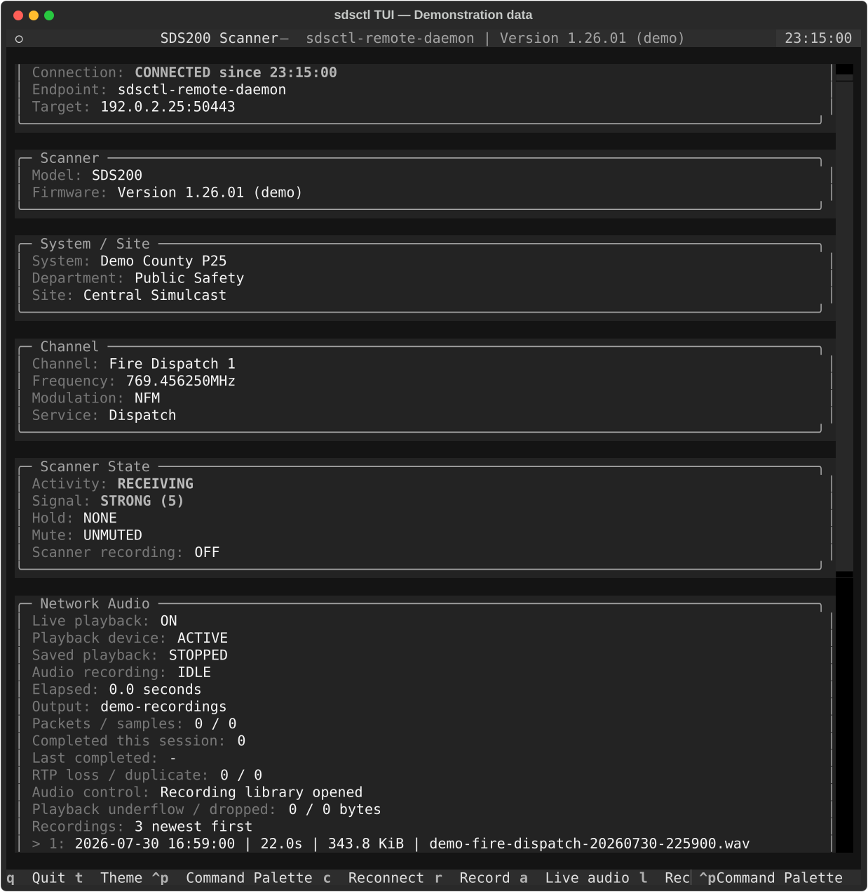
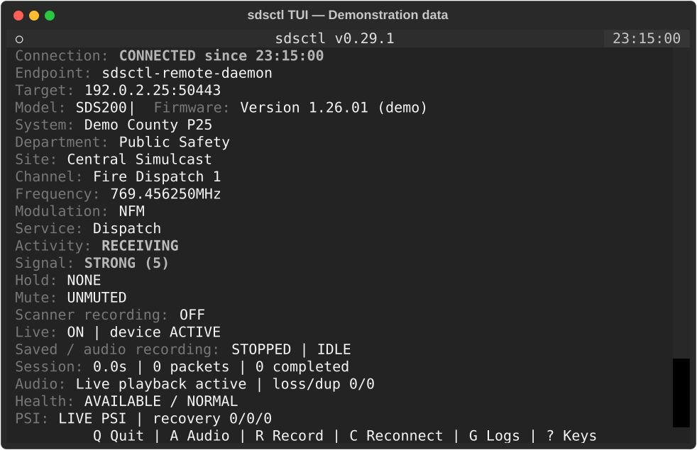
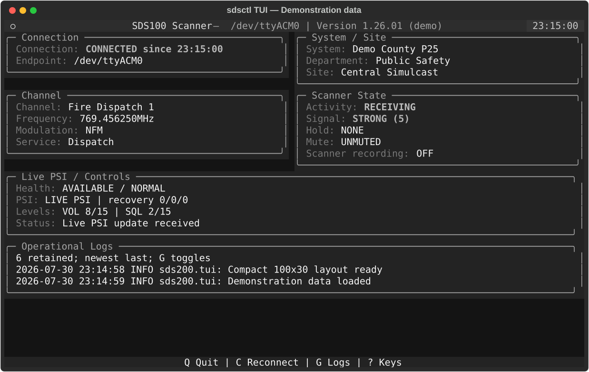

# Textual TUI

Version 0.13 introduced the optional full-screen Textual interface for SDS
scanners, and version 0.14 added integrated SDS200 network-audio recording.
Version 0.16 adds immediate live playback, repeatable recordings, a saved
recording library, recording metadata sidecars, a bounded in-app operational log
panel, and mode-aware Quick Search, Close Call, Weather, and Tone Out panels.
Milestone 19.10 adds explicit daemon-backed operation while preserving
standalone scanner ownership as the default. Textual and PortAudio remain
optional so the core installation stays lightweight.

## Interface previews

These images are generated by the real `ScannerTuiApp` with deterministic,
fictional demonstration data. They do not contain scanner captures, private
endpoints, agency information, or recordings from a real system.

### Wide operational view


The wide layout places the main operational panels in two columns and keeps the
bounded log panel visible across the full width.

### Recording library



The recording library presents compatible WAV recordings newest first and
supports selection, playback, pause, resume, and return to live audio.

### Compact layout



The compact layout removes decorative borders and unused spacing and replaces
the full footer with essential controls. Network sessions keep concise audio and
PSI health summaries visible; direct USB sessions omit audio-only rows and
shortcuts that their transport cannot use.

### Direct USB compact layout



This deterministic SDS100 USB view uses the same 100-column by 30-row geometry
reported by the physical Raspberry Pi display. Removing the incapable Network
Audio panel returns those rows to scanner state, controls, and logs while the
scanner's own recording indicator remains explicit.

Install the optional interface from PyPI:

```bash
python -m pip install "sds200[tui]"
```

For source development, the `dev` extra includes Textual:

```bash
python -m pip install -e ".[dev]"
```

Launch the interface with the same USB, network, profile, or replay selectors used
by other `sdsctl` commands:

```bash
sdsctl tui
sdsctl --host 192.168.0.251 tui
sdsctl --profile home tui
sdsctl --replay tests/fixtures/replay/sds100-tui-live.jsonl tui
```

When a foreground daemon already owns the SDS200, explicitly select daemon mode:

```bash
sdsctl tui --daemon-client
sdsctl tui --daemon-client \
  --audio-playback \
  --audio-directory ~/recordings \
  --audio-metadata
```

For an authenticated ordinary-host daemon on a private network, select one
exact named profile from `daemon-remote-clients.toml`:

```bash
sdsctl tui --daemon-client --remote-profile pi-display
```

The profile is never selected merely because its file exists and cannot be
combined with local daemon socket overrides. See the
[authenticated remote daemon guide](daemon-remote.md) for certificate trust,
per-client credential provisioning, permissions, firewall direction, and
rotation or revocation.

Standalone mode starts continuous PSI scanner-information updates after loading
the model, firmware, and initial GSI snapshot. Daemon mode obtains authoritative
identity and initial state from `daemon.sock`, follows ordered state and
connection updates from `events.sock`, delegates safe controls through the API,
and consumes audio from `pcmu.sock`. A named remote profile uses independent
authenticated API, event, and accepted-PCMU service connections instead. A
recovered event stream must begin with a new authoritative snapshot; recovered
audio clears invalid continuity state. Deterministic configuration, TLS,
authentication, authorization, service, and protocol failures do not retry.
Neither daemon mode opens scanner hardware or another RTSP/RTP session.

The default 500 ms update interval and 3 second freshness threshold may be
adjusted independently:

```bash
sdsctl --host 192.168.0.251 tui --interval 250 --stale-after 2
```

When a UDP transport remains logically connected but stops delivering PSI frames,
the TUI warns at the stale threshold and automatically queues the existing
nonblocking reconnect operation after 10 seconds. Attempts are rate-limited to
one per 60 seconds and do not stop an active SDS200 network-audio recording:

```bash
sdsctl --host 192.168.0.251 tui \
  --psi-recover-after 10 \
  --psi-recovery-cooldown 60
```

Use `--no-psi-auto-recover` to retain warning-only behavior. The recovery
never begins before `--stale-after`; a smaller recovery value is
raised to the stale threshold. Operational recovery
entries can be persisted with the options described in
[Operational logging](logging.md).

The interface shows:

- connection endpoint and connected, degraded, or disconnected status with the local transition time
- scanner model and firmware
- system, department, and site during normal scanning screens
- channel, frequency, modulation, and service type during normal scanning
- mode-aware Quick Search and Close Call panels showing the raw screen mode,
  source state node, search frequency or hit name, modulation, hold state,
  signal, RSSI, and scanner-reported detected tone or digital code
- mode-aware Weather panels showing the raw screen mode, `WxChannel` state node,
  weather channel and number, frequency, modulation, monitor or alert mode,
  hold state, signal, RSSI, and scanner-reported SAME selection
- mode-aware Tone Out panels showing the raw screen mode, `ToneOutChannel` state
  node, profile and channel number, monitored frequency, modulation, Tone A and
  Tone B values, hold state, signal, and RSSI
- semantic activity, signal, hold, mute, and scanner recording state
- live PSI, reconnect, diagnostic, and stale-data status
- automatic PSI recovery attempt, success, and failure totals
- a bounded newest-last operational log panel, visible by default
- availability and severity derived from the shared presentation model, each with the local transition time

Radio callbacks originate on control-transport threads. The adapter marshals every
widget update into Textual's event loop, unsubscribes callbacks on shutdown, and
stops PSI before the scanner connection closes. Reconnects retain the last known
state while making its disconnected or stale status explicit.

The interface uses the same renderer-independent `ScannerPresentation`,
`ThemeRole`, and light/dark palettes as the Rich CLI. Meaning remains visible in
text labels rather than relying on color alone.

The two built-in terminal themes are independently packaged under
`sds200/themes/tui/<theme-name>/`. Their versioned manifests declare stable
`dark` and `light` identities, complete `palette.json` files retain all semantic
role styles, and `theme.tcss` owns only Textual colors, backgrounds, and borders.
The validated immutable registry preserves the existing `default-dark` and
`default-light` compatibility objects and deterministic stylesheet order.
Dimensions, padding, scrolling, responsive breakpoints, widgets, and scanner
meaning remain shared TUI code. Valid managed packages under the resolved
`themes/tui/<id>/` directory are discovered once at command startup and can be
selected with `--theme <id>`, the `theme` configuration field, or
`SDSCTL_THEME`. Textual applies the selected complete semantic palette and its
in-memory stylesheet under the package's unique screen class. Managed TCSS is
limited to scoped color, background, and border rules; layout remains shared.
Installing, replacing, or removing a package takes effect in a new process.

Quick Search, Close Call, Weather, and Tone Out screens were physically
validated on an SDS200 running firmware `1.26.01` over the UDP control
transport. One continuous PSI session successfully transitioned through normal
conventional and trunk scanning, Quick Search Hold, Close Call searching and
Hold, Weather Scan and Hold, Tone Out standby and Hold, and back to normal
scanning.

The physical scanner reported Close Call Only frequency states through
`SrchFrequency`; its `cc_searching` screen contained no frequency node. Weather
Scan and Hold both used `V_Screen="wx_alert"` with `WxChannel`, while Tone Out
used `ToneOutChannel` with profile, index, channel number, monitored frequency,
Tone A, Tone B, and hold state. Temporary menu frames may retain a weather
screen or node while mode navigation is in progress.

Raw hardware captures remain outside the repository because they contain local
scanner data. Sanitized synthetic fixtures preserve the observed structures.
`CcHitsChannel`, SAME alert content, and an actual Tone Out detection were not
observed during this validation and remain specification-backed synthetic
coverage rather than claimed physical validation.

Keyboard shortcuts:

- `Q`: exit and close only resources owned by this TUI; daemon mode leaves the
  foreground daemon running
- `T`: toggle between built-in dark and light; from a managed theme, return to
  built-in dark
- `C`: request bounded daemon reconnect in daemon mode, or restart the
  standalone control transport
- `R`: start or stop an SDS200 network-audio WAV recording
- `A`: toggle live scanner playback without stopping the RTSP/RTP stream
- `L`: show or hide the newest compatible recordings
- `G`: show or hide the operational log panel without discarding buffered records
- `Up` / `Down`: select a saved recording
- `Enter`: play the selected recording and temporarily suspend live playback
- `Space`: pause or resume saved playback
- `Esc`: stop saved playback, restore enabled live playback, and close the library
- `Ctrl+P`: open Textual's Command Palette
- `?`: show or hide the complete keyboard reference
- `H`: toggle the current channel between explicit hold and release
- `S`: toggle the current system between explicit hold and release
- `D`: toggle the current department between explicit hold and release
- `I`: toggle the current site between explicit hold and release
- `N`: move to the next indexed channel
- `P`: move to the previous indexed channel
- `+` / `-`: raise or lower volume
- `]` / `[`: raise or lower squelch

Scanner commands execute sequentially on a background worker so a slow command
round trip does not block the Textual event loop. Hold controls derive the exact
opposite desired state from live GSI/PSI and wait for scanner-confirmed state;
they do not optimistically rewrite the local snapshot. Volume and squelch
increments clamp to the connected model's capability bounds and likewise wait
for authoritative state in direct and daemon-backed modes. Channel next/previous
controls require a documented `TGID` or conventional-frequency index. The status
panel reports queued, completed, unavailable, and failed controls without relying
on color alone. SDS200 firmware 1.26.01 native-UDP testing physically accepted
the shared direct and daemon-owned setter paths. The firmware returns `VOL,OK`
and `SQL,OK`; completion uses matching scalar getters so it remains authoritative
even when the current `GSI` screen omits the levels. The connection, availability,
and severity labels include `since HH:MM:SS` using local time; the timestamp
changes only when the displayed state changes. Repeated unchanged PSI frames
still refresh data freshness, preventing an active but stable channel from aging
into a false stale state. Only an actual absence of valid PSI frames triggers
automatic recovery.

While the full-screen TUI is active, package log records are routed to the bounded
in-app panel instead of stderr so they cannot corrupt the Textual display. The
panel retains the newest 200 lines and displays the newest six; hiding it with `G`
does not stop collection. An optional `--log-file` handler remains active and
continues receiving every record allowed by the selected log level. Normal stderr
logging is restored when the TUI exits.

The deterministic `sds100-tui-controls.jsonl` replay is a strict, one-shot command
script rather than a scanner simulator. For a manual control pass, start a fresh TUI
session and tap `H`, `S`, `D`, `I`, `N`, `P`, `+`, and `]` exactly once in that
order. Quit and restart the replay to reset its command cursor after any deviation.

## Responsive Raspberry Pi layout

The interface adapts automatically to terminal dimensions; no compact-mode flag is
required. Terminals narrower than 80 columns remove decorative borders and spacing.
At fewer than 32 rows, the dedicated identity panel is hidden, panel borders and
vertical gaps are removed, and the full Textual footer is replaced by a one-line
essential-controls footer. The model remains in the title, while the endpoint and
firmware remain in the header subtitle.

Short layouts with a network-audio session use four-line audio and PSI health
summaries. They retain playback, audio recording, elapsed-session, packet-loss,
availability, severity, stream-recovery, volume, squelch, and current-status
information without forcing the status panel below the initial viewport. A
direct USB session has no scanner network-audio source, so its playback, saved
playback, audio-recording, and audio-control rows are omitted entirely. The
scanner's own memory-card state remains visible as `Scanner recording`.
Opening the recording library still shows its detailed entries, and the main
content remains vertically scrollable.

At 120 columns or wider, panels switch to a two-column dashboard. An 80 by 24
terminal is the recommended Raspberry Pi starting size. The deterministic suite
also covers 64 by 20 compact and 90 by 28 Raspberry Pi-like terminals. The compact
footer exposes `Q` quit, `C` reconnect, `G` logs, and `?` keyboard help. When
network audio is available, it also exposes `A` audio and `R` record.

Headless Textual tests exercise compact, Raspberry Pi-like, standard, and wide
terminal sizes, including a live resize from the short summary view back to the
full detailed layout.

Physical network-audio validation passed on a Raspberry Pi 4 driving an 800 by
480 display at 100 by 30 terminal cells. The initial display rendered cleanly;
the compact footer, operational summaries, and logs were visible; live playback
and its mute toggle worked; logs and keyboard help opened and closed correctly;
a WAV recording finalized successfully and appeared in the recording library;
scrolling remained usable; and the TUI exited cleanly. Direct SDS100 USB
validation of the transport-aware compact layout is the Milestone 33.1 physical
acceptance target.

## Network audio playback, recording, and library

Standalone TUI audio requires an explicit SDS200 network host. Daemon-backed TUI
audio instead consumes the daemon-owned PCMU socket. Both modes expose the same
manual live and saved playback controls. Request automatic live playback and
create repeatable timestamped recordings in one directory:

```bash
sdsctl --host 192.168.0.251 tui \
  --audio-playback \
  --audio-directory ~/recordings
```

Install both optional feature sets for that workflow:

```bash
python -m pip install "sds200[tui,playback]"
```

On Debian or Raspberry Pi OS, also install the PortAudio runtime:

```bash
sudo apt update
sudo apt install libportaudio2
```

Use `sdsctl audio-devices` to inspect the default output, PortAudio host APIs, and
output-capable devices before launching the TUI.

Press `A` to start live playback manually, even when `--audio-playback` was not
provided. The output device opens only when playback first starts and remains
prepared while playback is muted, avoiding repeated PortAudio initialization.

Use `--audio-playback` to request automatic startup after connected live state is
available. In standalone mode this follows the first live PSI update; in daemon
mode it follows the authoritative snapshot and ordered event stream. Select a
different output with `--audio-device`, and adjust the bounded playback queue
with `--audio-buffer-ms`.

Press `R` to start and stop recordings. Directory mode generates local-time names
such as `sds200-20260729-025501.wav`; collisions add `-2`, `-3`, and later suffixes.
Use `--audio-template` to replace the basename while retaining the required
`{timestamp}` field.

Add `--audio-organize-by` with an ordered comma-separated subset of `scanner`,
`date`, `system`, `department`, `site`, and `channel` to place new recordings in
safe nested directories. Organization uses one immutable start-boundary snapshot;
a later scanner-state change does not move the recording. Missing values become
`unknown`, collision suffixes remain in the selected directory, and metadata
sidecars stay adjacent. Existing recordings are not moved. The legacy
`--audio-output FILE` mode remains protected and one-shot; `--audio-force` applies
only to that explicit file.

Press `L` to show up to `--audio-history-limit` compatible 8 kHz mono signed 16-bit
PCM WAV files, newest first. Each row includes its filesystem timestamp, duration,
size, and filename. Select with the arrow keys, press `Enter` to play, use `Space`
to pause or resume, and press `Esc` to stop and close the library. Saved playback
temporarily suspends local live playback but does not stop scanner reception or an
active recording. Previously enabled live playback resumes automatically.

The audio panel reports live and saved playback state, active output, elapsed time,
packet and sample totals, completed-session count, last completed file, recording
history, playback underflows and drops, and RTP reliability counters. TUI shutdown
finalizes an active WAV, stops saved playback, closes the output device, and closes
the TUI-owned audio client. Standalone mode also tears down its RTSP/RTP stream;
daemon mode leaves the daemon-owned scanner, PSI, RTSP/RTP audio, router, and
other clients running. Advanced RTSP/RTP options remain available only in
standalone mode as `--audio-rtsp-port`, `--audio-rtp-bind-address`,
`--audio-rtp-bind-port`, and `--audio-keepalive-interval`.

Daemon-backed operation was physically validated on August 5, 2026, with a
physical SDS200. The initial display rendered cleanly, live scanner state and a
safe control flowed through the daemon, automatic playback and `A`-key toggling
worked, and `R` finalized a valid 53.120-second 8 kHz mono WAV with metadata.
Quitting the TUI left the original daemon and its scanner, PSI, audio, and router
ownership running. Controlled `SIGTERM` later removed all three daemon sockets.

Project authorship and AI-assisted development are documented in [Acknowledgments](../ACKNOWLEDGMENTS.md).
