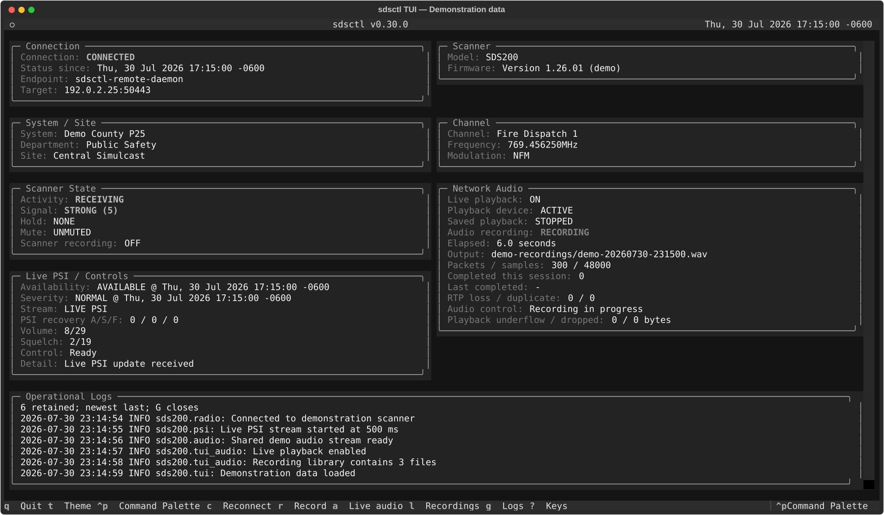
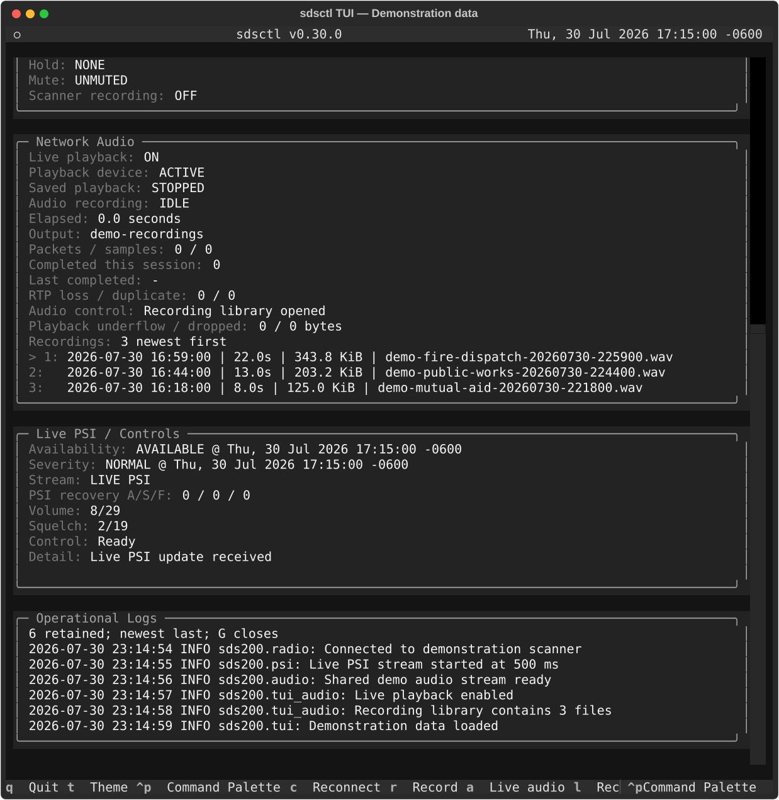
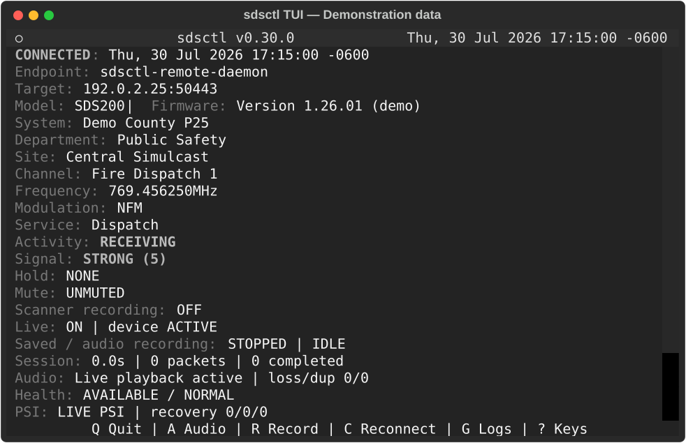
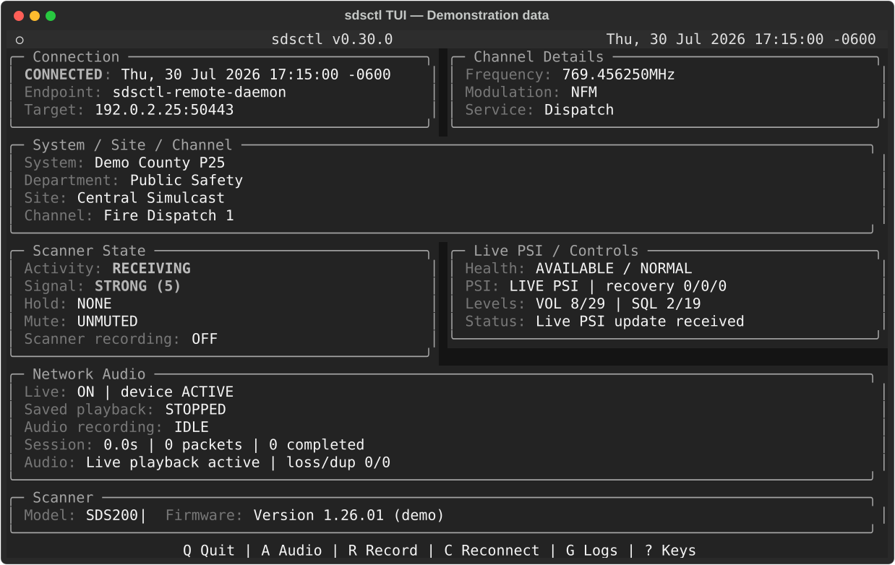
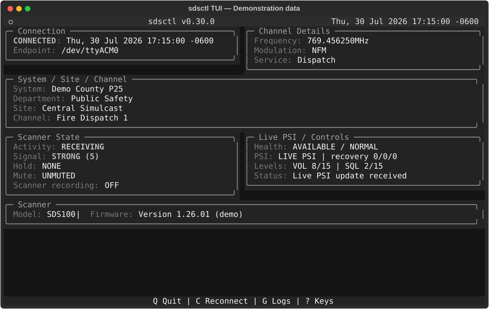

# Textual TUI

Version 0.13 introduced the optional full-screen Textual interface for SDS
scanners, and version 0.14 added integrated SDS200 network-audio recording.
Version 0.16 adds immediate live playback, repeatable recordings, a saved
recording library, recording metadata sidecars, a bounded in-app operational log
panel, and mode-aware Quick Search, Close Call, Weather, and Tone Out panels.
Milestone 19.10 adds explicit daemon-backed operation while preserving
standalone scanner ownership as the default. Textual and PortAudio remain
optional so the core installation stays lightweight.

## Local date and time (v0.30.0)

Version 0.30.0 replaces the header's time-only clock with the full
local date and 24-hour time, for example `Fri, 11 Sep 2026 06:26:10 -0600`.
This is RFC 2822-style formatting: English weekday/month names, a four-digit
year and an explicit numeric UTC offset. Each display uses its own operating
system's time zone, including daylight-saving changes—not the daemon's time
zone. `-0600` means six hours behind UTC; `+0000` is shown on a UTC-configured
host. The application name/version stays in
the header and scanner model/firmware stays in the Scanner panel. The clock
updates once per second; an unavailable or timezone-ambiguous clock is labeled
`Local time unavailable` rather than showing a fabricated timestamp.

On taller screens the Connection panel keeps its connection label on one line
and adds a separate `Status since: Fri, 11 Sep 2026 06:26:10 -0600` line.
Short screens use `CONNECTED: Fri, 11 Sep 2026 06:26:10 -0600` on one line,
preserving room for the other panels on the small Pi, including network audio.
The compact timestamp and detailed `@` notation both mean status since.
This is when this TUI first observed the current **displayed status**, not socket
uptime or the original daemon/scanner connection time. It can change when a
connection becomes degraded and resets when the TUI starts. Repeated frames,
redraws, resizes and theme changes do not reset it. The taller Live PSI panel's
availability/severity rows use `@` followed by the same full local date/time.
An observation keeps the offset in effect when it was recorded, even across
daylight-saving changes; the live header clock uses the offset for the current
instant. On narrower two-column displays, `Health` abbreviates `Availability`
to keep the longer timestamp visible.

On a Raspberry Pi, `timedatectl` shows the configured time zone. To change it,
use `sudo timedatectl set-timezone America/Denver`, substituting your local
IANA time-zone name, then restart the display service. In an SSH session or a
GUI terminal, the TUI uses the machine running the client, not the viewing
computer. No console font change is involved.

An unavailable timestamp stays unavailable for that status observation, even
if the clock later recovers; the TUI does not invent the missing start time.
A new status uses the new clock reading. This does not add an elapsed-duration
counter, alter console fonts or change managed-display startup. The date/time
layout passed physical checks on both Pi displays, including published-client
acceptance; see the [v0.30.0 release record](release-0.30.0.md). The previews below
record an earlier layout. The separate, unreleased connected-daemon version
follow-up is described below.

The wide layout also reserves room for every Connection and Scanner State row,
including the remote target and scanner-reported recording status beside the
taller Network Audio panel. These fields must not be present only in hidden,
clipped panel content.

## Unreleased connected-daemon version follow-up

Daemon-backed sessions show the endpoint's reported application version in the
Connection panel, for example `Daemon: 0.30.0 | sdsctl-remote-daemon`. This shares
the former Endpoint row to preserve room at both 100×30 and 160×45; the Target
row is retained. The local TUI version remains in the header and physical scanner
firmware remains in the Scanner panel. Direct scanner sessions are unchanged.

The value comes from the existing daemon snapshot, not an assumption that client
and daemon were upgraded together. Older daemons or malformed/missing metadata
show `Daemon: Unavailable`. Losing the daemon event connection clears the cached
version; a fresh reconnect snapshot supplies the replacement. A scanner outage
alone does not erase the version of a still-connected daemon. No additional
scanner command, polling request, credential, or capability is added.

Long versions/endpoints are ellipsized to the Connection panel width, not wrapped
into a hidden row. The Mimic-SDS runtime drawer retains the full bounded daemon
version and endpoint alongside the separate client and scanner identities.
When the event-link duration is present in the compact 100×30 split, the
redundant symbolic endpoint is omitted from the Daemon row instead of being
ellipsized to a meaningless fragment; the concrete Target row remains visible.
The 160×45 layout and runtime drawer continue to show the endpoint.
Local geometry tests cover both Pi sizes and themes, audio/no-audio, metadata
changes and resizing. On September 28, 2026, the installed development wheel at
`824c417` passed user-observed readability and keyboard checks on the 100×30 and
160×45 bench Pis using a fictional, offline endpoint. Both original displays were
restored with their configuration and fonts unchanged. This verifies physical
presentation, not a real daemon's reported version or live transport behavior.

## Unreleased daemon event-link duration follow-up

Daemon-backed sessions also show `Link for HH:MM:SS` on the existing Daemon row,
or `Nd HH:MM:SS` after 24 hours. This is the elapsed age of this TUI client's
current daemon **event-stream link**. It is not daemon process uptime, scanner
connection age, PSI freshness, or the age of the initial API snapshot. Direct
scanner and replay sessions do not gain this field.

The adapter records a monotonic start only after the stream supplies its first
authoritative snapshot. A preliminary API snapshot therefore shows
`Link for Unavailable` rather than inventing an earlier start. Event-stream loss
returns the value to `Unavailable`; a successful reconnect begins again only
after its fresh authoritative snapshot. A scanner-only disconnect, stale PSI,
degraded status, theme change, resize or redraw does not reset the event link.
Disconnected time is never added to a later link.

On October 2, 2026, a live authenticated 100×30 Small Pi pass showed the timer
advancing but exposed `Unavailable | s. | Link for ...`: the older published
daemon correctly lacked application-version metadata, while the compact row
retained a useless fragment of the redundant symbolic endpoint. Commit
`37a414a` removed only that compact endpoint token. The separate Target row,
wide endpoint, full runtime metadata and honest `Unavailable` version remained.
The repaired installed wheel then received the user's `visual pass`; the finite
guard restored the byte-identical original service and normal Home Assistant App
ownership.

A second guarded Small Pi run restarted that same published Home Assistant App
while sampling the 100×30 text console. The pre-outage link reached `00:00:51`.
Event loss changed it to `Link for Unavailable`, retained the concrete target,
and then entered the managed `Daemon disconnected` waiting screen. Recovery used
a fresh authoritative connection timestamp, first rendered `00:00:00`, and
advanced normally; no pre-outage time survived the reconnect. The finite guard
again restored the byte-identical original service and normal App ownership.
This qualifies the live outage/reconnect behavior on the Small Pi, not the
160×45 physical layout.

Duration uses the TUI host's monotonic clock and whole elapsed seconds. It does
not jump when the wall clock or daylight-saving offset changes, add a tolerance,
approximate calendar months/years, or wrap at 24 hours. Missing, non-finite or
future clock observations are `Unavailable`. A one-second in-memory refresh makes
the value advance without another daemon request or scanner command. The full
runtime drawer labels the same value `Daemon event link for`.

The Daemon row retains its existing row budget. During a wide-to-compact resize,
the version/endpoint prefix is ellipsized against both current panel geometry and
the incoming 100×30 two-column width before the fixed link suffix is appended.
Automated checks cover the exact 59/60, 3599/3600 and 86399/86400 boundaries,
multi-day values, invalid/unknown sources, initial stream establishment,
scanner-only disconnect, event loss, authenticated reconnect, direct-session
absence, both Pi geometries, themes, audio/no-audio and live resize. This does
not yet claim a live endpoint or physical-display acceptance pass.

## Unreleased read-only scanner details

From the ordinary dashboard, press **X** or choose **Scanner details** in the
command palette. This opens a separate scrollable view of the existing shared
scanner snapshot: mode, channel, talkgroup ID, unit ID, reported P25 status and
raw battery telemetry. **Esc** or **X** returns to the dashboard without adding
rows to its compact layout. Inside Mimic-SDS, **X** keeps its existing runtime/help
meaning; it does not open this drawer.

These values require no additional scanner command, daemon request or connection.
IDs retain their reported prefixes and leading zeroes. Missing fields show
`Unavailable`; battery values have no inferred volts/percent label, and unknown
P25 text does not imply encryption or reception quality. Controls/formatting
characters are replaced and long text is ellipsized at 128 terminal cells without
changing the underlying snapshot. This is raw reported telemetry, not new
model/firmware support.

The drawer clears values during disconnection, stale data or a degraded
connection. Reconnection alone does not restore the preceding channel's values:
it waits for a fresh snapshot. Normal incoming updates continue while it is open.
Scanner and audio action keys are inactive in this read-only view; existing audio
and recording sessions continue unchanged. Return to the dashboard for controls.
Quit remains available. The command palette contains only Back and Quit here.
Automated checks cover direct/shared-daemon fields, both Pi sizes, the narrower
fallback, light/dark, resizing and clearing. The same September 28 offline Pi
checks passed for drawer readability, changing values and unavailable fields,
theme inheritance, return navigation and inactive action keys. Those fictional
values do not qualify new physical scanner fields, models or live audio behavior;
the candidate remains unreleased.

## Unreleased read-only relative waterfall candidate

A daemon-backed TUI can open the existing shared waterfall stream with **W**
or **Relative waterfall** in the command palette. The direct scanner and replay
TUIs do not advertise this action. Opening the view creates one local-socket or
authenticated-remote waterfall client; it does not issue `PWF` or `GWF`
commands, open scanner hardware, or create a second acquisition owner. Closing
the view releases that consumer lease while the daemon remains responsible for
the demand-driven scanner session and last-consumer cleanup.

The view validates exactly 240 hexadecimal source strings, converts them to a
per-frame relative 0-to-1 range, and renders a bounded 256-row terminal history.
A constant frame uses the neutral midpoint. Each row redundantly represents
that normalized value with both its existing glyph ramp and three explicit
relative-intensity bands: green `LOW`, yellow `MID`, and bold red `HIGH`. The
colors improve visual hierarchy without making color the only carrier of
meaning. They are not calibrated weak/medium/strong signal thresholds. This is
an uncalibrated relative display: it does not label values as dB, signal
strength, spectrum power, FFT magnitude, or a higher acquisition rate. Lower,
center and upper frequency fields are shown literally as raw scanner metadata
without inferred units.

The footer retains the validated timezone-aware source timestamp in the model
and converts only its displayed form to the TUI host's configured local timezone.
It is labeled `Source local timestamp` and keeps an explicit UTC offset. When the
TUI is viewed over SSH or on a managed display, "local" therefore means the
machine running the TUI, not the browser, SSH client, scanner, or daemon host.

Inside the waterfall view:

- **Space** pauses or resumes only this client's local display history; the
  daemon stream continues so lifecycle and loss counters stay current.
- **C** clears only this client's local latest frame and history. It does not
  clear daemon state or send a scanner command.
- **W** or **Esc** closes the view and returns to the ordinary dashboard.
- **Q** quits the TUI, and **Ctrl+P** opens the limited waterfall command
  palette. Ordinary scanner, audio and recording actions remain inactive until
  returning to the dashboard.

History is resampled to available terminal columns and clipped to the visible
rows on each redraw; source acquisition is unchanged. Automated layout checks
cover 100×30 and 160×45 terminals plus live resize. A transport failure clears
the unconfirmed frame, history and session metadata before obtaining a fresh
client whose first record must be a new checkpoint. Invalid payload content
fails closed without a retry loop. Closing or quitting interrupts the pending
receive by closing its dedicated client and uses a bounded worker join.

The daemon-client CLI accepts optional
`--daemon-waterfall-socket-path` and
`--daemon-waterfall-max-record-bytes` settings. An authenticated
`--remote-profile` selects its existing authorized `waterfall` service; local
socket overrides remain mutually exclusive with that profile. The record bound
cannot exceed the protocol's 64 KiB limit. These options are inert until the
view is opened.

Synthetic tests establish validation, bounds, pause/clear, reconnect,
responsive rendering, direct-session absence, dark/light color contrast and
cleanup. They do not establish physical terminal color quality, frequency
semantics, or another model/firmware. The glyph-only candidate passed functional
visual review on both Pi geometries, but the HDMI review found its dense
punctuation difficult to interpret as a human signal display. The three-band
relative-intensity treatment remains an unreleased follow-up until a concise
physical visual check confirms the improvement. No release claim follows from
the offline render alone.

## Unreleased Mimic-SDS candidate

Mimic-SDS is a separate, read-only screen in the local development candidate.
The ordinary TUI remains the startup view. When a configured daemon advertises
the shared display-frame service, press **M** or choose **Mimic-SDS** in the
command palette to open it. The existing daemon client profile, identity and
permissions are reused; there is no new scanner connection or credential.
Older daemons and direct-USB sessions keep their existing interface without this
action. Direct-USB profile configuration remains a separate delivery item.

Inside Mimic-SDS:

- **V** cycles imported profile preference, Simple and Detail. This changes only
  this client's presentation, not the physical scanner's manual display toggle.
- **B** switches the reported alert color between top/bottom strips and a border.
  Blink timing is not inferred from the color. Configured alert-pattern matching
  remains separate work.
- **X** or **?** opens the runtime/help drawer; **Esc** or **X** returns from it.
  It shows profile qualification at drawer-open time, current TUI connection and
  scanner identity, available client audio/recording state, and the latest 20
  operational log lines. When the daemon advertises the versioned front-panel
  inventory, the drawer also lists all 27 codes with their model-reference and
  unavailable reasons. The snapshot is validated once before the TUI starts;
  opening or refreshing the drawer performs no API request. These labels are not
  keyboard shortcuts: every entry remains disabled and the TUI installs no
  general scanner-key dispatch. An older daemon shows inventory unavailable.
  This is not an additional daemon recording-status feed.
- **M** or **Esc** returns from Mimic-SDS to the ordinary TUI. **Q** quits the
  application. **Ctrl+P** opens the command palette. Scanner/audio control keys
  are inactive inside Mimic-SDS and its drawer; return to the ordinary TUI to
  operate the scanner.

Layout and LED choices survive closing/reopening the screen in the same TUI
process, but are not saved across restarts. The app/version and local RFC 2822
clock remain in the header. Profile colors, alignment and individual name-hold
inversion use the shared frame mapping; no generic labels are added to name
bands. Simple/Detail selection applies to Conventional and Trunk families; the
special screen family remains shared. Waterfall is separate.

The scanner grid needs at least 60 columns and 22 rows of content space (26
terminal rows including the current header/footer). Below that, a resize/back
message replaces the grid. At 100×30 and 160×45, synthetic Textual tests show the
complete grid without dashboard scrolling. Wider/taller windows scale the grid
in terminal cells, with bounded rendering up to 500×160 content cells; text
wraps only in the supported Simple name bands and otherwise clips with an
ellipsis. No console font is changed. Terminal capabilities determine color
approximation; `NO_COLOR` is respected. Missing/unqualified fields and
BLACK/WHITE profile transformations are not invented.

Only a visible Mimic-SDS screen requests frames. Opening a drawer or palette,
returning to the ordinary TUI, or exiting clears live values and stops requests.
A pending finite read may finish in the background, but its result is discarded
and its dedicated API connection is closed by the worker. Resuming requires a
new read. Stale, disconnected, malformed or failed responses never leave old
values looking current. See the [frame API guide](scanner-display-frame-api.md#candidate-tui-presentation)
for timeout, freshness and compatibility details. This remains development
candidate support, not a published release.

On September 28, 2026, the installed development wheel at `824c417` passed
user-observed Mimic-SDS visual and keyboard checks on both bench Pis: 100×30
and 160×45 Linux consoles. The isolated, offline fixture used fictional profile
colors and scanner data to exercise the grid, layout/LED choices, runtime drawer,
hold/release and stale/recovery presentations. Both original display services
were restored, with their published installations, saved profiles and console
fonts unchanged. This qualifies physical presentation of those fixtures, not
live scanner field accuracy, supplemental-reader admission, audio, or release
readiness.

## Interface previews

These images are generated by the real `ScannerTuiApp` with deterministic,
fictional demonstration data. They do not contain scanner captures, private
endpoints, agency information, or recordings from a real system.

The top header identifies the application as `sdsctl v<app version>`, using the
same package version as `sdsctl --version`. Scanner model and firmware remain in
the Scanner panel; endpoint and remote target remain in Connection. On short
terminals the Scanner panel uses one content line. The 100-by-30 dashboard
places that compact, full-width panel below Audio or Logs without adding scroll
to the ordinary dashboard.

### Wide operational view



The wide layout places the main operational panels in two columns. At 120 or
more columns and at least 32 rows, Live PSI / Controls sits directly below
Scanner State, beside Network Audio when available. The bounded Operational Logs
panel occupies its own full-width row below those panels.

On this larger layout, `?` toggles Keyboard Reference without closing Logs, and
`G` toggles Logs without closing the reference. Both can stay open together;
the complete keyboard reference may require scrolling. Smaller terminals retain
their space-saving, mutually exclusive drawers.

### Recording library



The recording library presents compatible WAV recordings newest first and
supports selection, playback, pause, resume, and return to live audio. This
100-by-50 capture is scrolled to Network Audio so all three demonstration files
are visible; the application header and keyboard shortcuts remain in place.

### Compact layout



The compact layout removes decorative borders and unused spacing and replaces
the full footer with essential controls. Network sessions keep concise audio and
PSI health summaries visible; direct USB sessions omit audio-only rows and
shortcuts that their transport cannot use.

### Raspberry Pi network layout



On short terminals at 100 through 119 columns, the compact split layout pairs
Connection with Channel Details, followed by a fixed-height, full-width System /
Site / Channel row. Scanner State then sits beside Live PSI / Controls, and an
Ethernet or daemon-backed Network Audio panel uses the full lower row. Tight
theme-colored frames preserve the same panel titles and visual grouping as the
larger dashboard without restoring its extra spacing. Long hierarchy values are
ellipsized instead of increasing the row height and pushing lower content off the
display.

Operational Logs start hidden at this geometry. `G` replaces Network Audio with
a seven-row, full-width drawer containing the newest four single-line records;
the bounded buffer continues collecting while the drawer is closed. `?` opens
the keyboard reference, and opening either drawer closes the other. This keeps
the ordinary dashboard and footer in the initial viewport while allowing more
useful log width when diagnosing an issue. Narrower or taller terminals retain
their established layout and visible bounded log panel, and the ordinary wide
layout remains available from 120 columns.

### Direct USB compact layout



This deterministic SDS100 USB view uses the same 100-column by 30-row geometry
reported by the physical Raspberry Pi display. Removing the incapable Network
Audio panel leaves the full lower row available until the Operational Logs drawer
is requested. Connection and Channel Details share the first row, System / Site /
Channel uses the fixed full-width second row, and Scanner State shares the third
row with Live PSI / Controls. The scanner's own recording indicator remains
explicit.

Install the optional interface from PyPI:

```bash
python -m pip install "sds200[tui]"
```

For source development, the `dev` extra includes Textual:

```bash
python -m pip install -e ".[dev]"
```

Launch the interface with the same USB, network, profile, or replay selectors used
by other `sdsctl` commands:

```bash
sdsctl tui
sdsctl --host 192.168.0.251 tui
sdsctl --profile home tui
sdsctl --replay tests/fixtures/replay/sds100-tui-live.jsonl tui
```

When a foreground daemon already owns the SDS200, explicitly select daemon mode:

```bash
sdsctl tui --daemon-client
sdsctl tui --daemon-client \
  --audio-playback \
  --audio-directory ~/recordings \
  --audio-metadata
```

For an authenticated ordinary-host daemon on a private network, select one
exact named profile from `daemon-remote-clients.toml`:

```bash
sdsctl tui --daemon-client --remote-profile pi-display
```

The profile is never selected merely because its file exists and cannot be
combined with local daemon socket overrides. See the
[authenticated remote daemon guide](daemon-remote.md) for certificate trust,
per-client credential provisioning, permissions, firewall direction, and
rotation or revocation.

Standalone mode starts continuous PSI scanner-information updates after loading
the model, firmware, and initial GSI snapshot. Daemon mode obtains authoritative
identity and initial state from `daemon.sock`, follows ordered state and
connection updates from `events.sock`, delegates safe controls through the API,
and consumes audio from `pcmu.sock`. A named remote profile uses independent
authenticated API, event, and accepted-PCMU service connections instead. A
recovered event stream must begin with a new authoritative snapshot; recovered
audio clears invalid continuity state. Deterministic configuration, TLS,
authentication, authorization, service, and protocol failures do not retry.
Neither daemon mode opens scanner hardware or another RTSP/RTP session.

The default 500 ms update interval and 3 second freshness threshold may be
adjusted independently:

```bash
sdsctl --host 192.168.0.251 tui --interval 250 --stale-after 2
```

Physical SDS200 network and SDS100 serial testing showed that the scanners can
end an otherwise healthy PSI push after roughly three minutes. Active direct
network and serial sessions therefore renew the configured push conservatively
after 120 seconds, under the shared nonblocking command lock and without
reopening scanner control. If a stream nevertheless remains logically connected
but stops delivering PSI frames, the TUI warns at the stale threshold and
automatically queues its recovery operation after 10 seconds. Attempts are
rate-limited to one per 60 seconds and do not stop an active SDS200 network-audio
recording:

```bash
sdsctl --host 192.168.0.251 tui \
  --psi-recover-after 10 \
  --psi-recovery-cooldown 60
```

Use `--no-psi-auto-recover` to retain warning-only behavior. The recovery
never begins before `--stale-after`; a smaller recovery value is
raised to the stale threshold. Operational recovery
entries can be persisted with the options described in
[Operational logging](logging.md).

The interface shows:

- connection endpoint and connected, degraded, or disconnected status with the local transition time
- scanner model and firmware
- system, department, and site during normal scanning screens
- channel, frequency, modulation, and service type during normal scanning
- mode-aware Quick Search and Close Call panels showing the raw screen mode,
  source state node, search frequency or hit name, modulation, hold state,
  signal, RSSI, and scanner-reported detected tone or digital code
- mode-aware Weather panels showing the raw screen mode, `WxChannel` state node,
  weather channel and number, frequency, modulation, monitor or alert mode,
  hold state, signal, RSSI, and scanner-reported SAME selection
- mode-aware Tone Out panels showing the raw screen mode, `ToneOutChannel` state
  node, profile and channel number, monitored frequency, modulation, Tone A and
  Tone B values, hold state, signal, and RSSI
- semantic activity, signal, hold, mute, and scanner recording state
- live PSI, reconnect, diagnostic, and stale-data status
- automatic PSI recovery attempt, success, and failure totals
- a bounded newest-last operational log panel, visible by default
- availability and severity derived from the shared presentation model, each with the local transition time

Radio callbacks originate on control-transport threads. The adapter marshals every
widget update into Textual's event loop, unsubscribes callbacks on shutdown, and
stops PSI before the scanner connection closes. Reconnects retain the last known
state while making its disconnected or stale status explicit.

The interface uses the same renderer-independent `ScannerPresentation`,
`ThemeRole`, and light/dark palettes as the Rich CLI. Meaning remains visible in
text labels rather than relying on color alone.

The two built-in terminal themes are independently packaged under
`sds200/themes/tui/<theme-name>/`. Their versioned manifests declare stable
`dark` and `light` identities, complete `palette.json` files retain all semantic
role styles, and `theme.tcss` owns only Textual colors, backgrounds, and borders.
The validated immutable registry preserves the existing `default-dark` and
`default-light` compatibility objects and deterministic stylesheet order.
Dimensions, padding, scrolling, responsive breakpoints, widgets, and scanner
meaning remain shared TUI code. Valid managed packages under the resolved
`themes/tui/<id>/` directory are discovered once at command startup and can be
selected with `--theme <id>`, the `theme` configuration field, or
`SDSCTL_THEME`. Textual applies the selected complete semantic palette and its
in-memory stylesheet under the package's unique screen class. Managed TCSS is
limited to scoped color, background, and border rules; layout remains shared.
Installing, replacing, or removing a package takes effect in a new process.

Quick Search, Close Call, Weather, and Tone Out screens were physically
validated on an SDS200 running firmware `1.26.01` over the UDP control
transport. One continuous PSI session successfully transitioned through normal
conventional and trunk scanning, Quick Search Hold, Close Call searching and
Hold, Weather Scan and Hold, Tone Out standby and Hold, and back to normal
scanning.

The physical scanner reported Close Call Only frequency states through
`SrchFrequency`; its `cc_searching` screen contained no frequency node. Weather
Scan and Hold both used `V_Screen="wx_alert"` with `WxChannel`, while Tone Out
used `ToneOutChannel` with profile, index, channel number, monitored frequency,
Tone A, Tone B, and hold state. Temporary menu frames may retain a weather
screen or node while mode navigation is in progress.

Raw hardware captures remain outside the repository because they contain local
scanner data. Sanitized synthetic fixtures preserve the observed structures.
`CcHitsChannel`, SAME alert content, and an actual Tone Out detection were not
observed during this validation and remain specification-backed synthetic
coverage rather than claimed physical validation.

Keyboard shortcuts:

- `Q`: exit and close only resources owned by this TUI; daemon mode leaves the
  foreground daemon running
- `T`: toggle between built-in dark and light; from a managed theme, return to
  built-in dark
- `C`: request bounded daemon reconnect in daemon mode, or restart the
  standalone control transport
- `R`: start or stop an SDS200 network-audio WAV recording
- `A`: toggle live scanner playback without stopping the RTSP/RTP stream
- `L`: show or hide the newest compatible recordings
- `G`: show or hide the operational log panel without discarding buffered records
- `X`: open read-only Scanner details from the ordinary dashboard (development
  candidate); inside Mimic-SDS it retains the runtime/help meaning
- `W`: open the read-only relative waterfall in a daemon-backed TUI
  (development candidate); inside that view, `Space` pauses local history,
  `C` clears local history, and `W` or `Esc` returns
- `Up` / `Down`: select a saved recording
- `Enter`: play the selected recording and temporarily suspend live playback
- `Space`: pause or resume saved playback
- `Esc`: stop saved playback, restore enabled live playback, and close the library
- `Ctrl+P`: open Textual's Command Palette
- `?`: show or hide the complete keyboard reference
- `H`: toggle the current channel between explicit hold and release
- `S`: toggle the current system between explicit hold and release
- `D`: toggle the current department between explicit hold and release
- `I`: toggle the current site between explicit hold and release
- `N`: move to the next indexed channel
- `P`: move to the previous indexed channel
- `+` / `-`: raise or lower volume
- `]` / `[`: raise or lower squelch

Scanner commands execute sequentially on a background worker so a slow command
round trip does not block the Textual event loop. Hold controls derive the exact
opposite desired state from live GSI/PSI and wait for scanner-confirmed state;
they do not optimistically rewrite the local snapshot. Volume and squelch
increments clamp to the connected model's capability bounds and likewise wait
for authoritative state in direct and daemon-backed modes. Channel next/previous
controls require a documented `TGID` or conventional-frequency index. The status
panel reports queued, completed, unavailable, and failed controls without relying
on color alone. SDS200 firmware 1.26.01 native-UDP testing physically accepted
the shared direct and daemon-owned setter paths. The firmware returns `VOL,OK`
and `SQL,OK`; completion uses matching scalar getters so it remains authoritative
even when the current `GSI` screen omits the levels. The connection, availability,
and severity timestamps track only when the displayed state changes. The
unreleased follow-up above uses full local dates with offsets instead of `HH:MM:SS`.
Repeated unchanged PSI frames
still refresh data freshness, preventing an active but stable channel from aging
into a false stale state. Only an actual absence of valid PSI frames triggers
automatic recovery.

While the full-screen TUI is active, package log records are routed to the bounded
in-app panel instead of stderr so they cannot corrupt the Textual display. The
panel retains the newest 200 lines and normally displays the newest six; hiding it
with `G` does not stop collection. The 100-through-119-column short dashboard uses
`G` as a full-width drawer and displays its newest four records. An optional
`--log-file` handler remains active and continues receiving every record allowed
by the selected log level. Normal stderr logging is restored when the TUI exits.

The deterministic `sds100-tui-controls.jsonl` replay is a strict, one-shot command
script rather than a scanner simulator. For a manual control pass, start a fresh TUI
session and tap `H`, `S`, `D`, `I`, `N`, `P`, `+`, and `]` exactly once in that
order. Quit and restart the replay to reset its command cursor after any deviation.

## Responsive Raspberry Pi layout

The interface adapts automatically to terminal dimensions; no compact-mode flag is
required. Terminals narrower than 80 columns remove decorative borders and spacing.
At fewer than 32 rows, the Scanner panel combines model and firmware on one
content line, vertical gaps are removed, and the full Textual footer is replaced
by a one-line essential-controls footer. Short layouts normally remove panel
borders as well; the 100-through-119 column split layout instead retains tight
theme-colored frames so each paired panel keeps its visible title and boundary.
The header shows only the application name and version; Connection retains the
endpoint and any remote target.

Short layouts with a network-audio session use four-line audio and PSI health
summaries. They retain playback, audio recording, elapsed-session, packet-loss,
availability, severity, stream-recovery, volume, squelch, and current-status
information without forcing the status panel below the initial viewport. A
direct USB session has no scanner network-audio source, so its playback, saved
playback, audio-recording, and audio-control rows are omitted entirely. The
scanner's own memory-card state remains visible as `Scanner recording`.
Opening the recording library still shows its detailed entries, and the main
content remains vertically scrollable.

At the physical 100-by-30 geometry, normal scanner screens use a fixed compact
dashboard: Connection and Channel Details share the first row, System / Site /
Channel spans the second, Scanner State and Live PSI / Controls share the third,
and Network Audio spans the fourth when available. The compact Scanner summary
uses a final full-width row below Audio or Logs. Named remote-daemon sessions
also show the resolved `host:port` as `Target` in Connection; direct USB and
standalone network-host sessions do not add that row. Hierarchy values stay on
one ellipsized line so changing systems or departments cannot shift the lower
panels. `G` replaces Network Audio with the bounded Operational Logs drawer, and
`?` opens the mutually exclusive keyboard reference.

At 120 columns or wider, panels switch to a two-column dashboard. An 80 by 24
terminal is the recommended Raspberry Pi starting size. The deterministic suite
also covers 64 by 20 compact and 90 by 28 Raspberry Pi-like terminals. The compact
footer exposes `Q` quit, `C` reconnect, `G` logs, and `?` keyboard help. When
network audio is available, it also exposes `A` audio and `R` record.

Headless Textual tests exercise compact, Raspberry Pi-like, standard, and wide
terminal sizes, including a live resize from the short summary view back to the
full detailed layout.

Physical network-audio validation passed on a Raspberry Pi 4 driving an 800 by
480 display at 100 by 30 terminal cells. The initial display rendered cleanly;
the compact footer, operational summaries, and logs were visible; live playback
and its mute toggle worked; logs and keyboard help opened and closed correctly;
a WAV recording finalized successfully and appeared in the recording library;
scrolling remained usable; and the TUI exited cleanly. Direct SDS100 USB
and daemon-backed SDS200 validation of the transport-aware split layout also
passed on this physical display for Milestone 33.1. The direct session omitted
all unavailable network-audio rows and shortcuts, gave Live PSI / Controls the
full lower row, and maintained complete 500 ms PSI frames across proactive
serial renewals without a reconnect. The observe-only daemon session retained
Network Audio beside Live PSI / Controls, kept the newest two log records and
footer in the initial viewport, and finalized a 20.68-second mono 8 kHz WAV plus
metadata without a warning, error, disconnect, or reconnect. The Home Assistant
App remained the only scanner owner throughout the remote pass and returned to
its default-closed TCP configuration afterward.

Milestone 33.2 retains those transport and audio behaviors while refining the
physical layout described above. The earlier side-by-side Network Audio and log
placement is historical acceptance evidence rather than the current 100-by-30
panel arrangement.

The refined arrangement was physically accepted on September 3, 2026, from
exact deployed code commit `df7a6b6a5fce7f80b52b1c6492af4d519b9919c7`.
The normal dashboard, four-record Operational Logs drawer, and mutually exclusive
drawer switching passed without scrolling the fixed dashboard or log view. The
complete Keyboard Reference remains scrollable by design at 30 rows.

For an already qualified observe-only remote profile, the
[managed Raspberry Pi display guide](managed-pi-display.md) adds physical-console
preflight, stable service-manager exit classes, and an opt-in systemd template.
It does not change ordinary interactive TUI startup.

## Network audio playback, recording, and library

Standalone TUI audio requires an explicit SDS200 network host. Daemon-backed TUI
audio instead consumes the daemon-owned PCMU socket. Both modes expose the same
manual live and saved playback controls. Request automatic live playback and
create repeatable timestamped recordings in one directory:

```bash
sdsctl --host 192.168.0.251 tui \
  --audio-playback \
  --audio-directory ~/recordings
```

Install both optional feature sets for that workflow:

```bash
python -m pip install "sds200[tui,playback]"
```

On Debian or Raspberry Pi OS, also install the PortAudio runtime:

```bash
sudo apt update
sudo apt install libportaudio2
```

Use `sdsctl audio-devices` to inspect the default output, PortAudio host APIs, and
output-capable devices before launching the TUI.

Press `A` to start live playback manually, even when `--audio-playback` was not
provided. The output device opens only when playback first starts and remains
prepared while playback is muted, avoiding repeated PortAudio initialization.

Use `--audio-playback` to request automatic startup after connected live state is
available. In standalone mode this follows the first live PSI update; in daemon
mode it follows the authoritative snapshot and ordered event stream. Select a
different output with `--audio-device`, and adjust the bounded playback queue
with `--audio-buffer-ms`.

Press `R` to start and stop recordings. Directory mode generates local-time names
such as `sds200-20260729-025501.wav`; collisions add `-2`, `-3`, and later suffixes.
Use `--audio-template` to replace the basename while retaining the required
`{timestamp}` field.

Add `--audio-organize-by` with an ordered comma-separated subset of `scanner`,
`date`, `system`, `department`, `site`, and `channel` to place new recordings in
safe nested directories. Organization uses one immutable start-boundary snapshot;
a later scanner-state change does not move the recording. Missing values become
`unknown`, collision suffixes remain in the selected directory, and metadata
sidecars stay adjacent. Existing recordings are not moved. The legacy
`--audio-output FILE` mode remains protected and one-shot; `--audio-force` applies
only to that explicit file.

Press `L` to show up to `--audio-history-limit` compatible 8 kHz mono signed 16-bit
PCM WAV files, newest first. Each row includes its filesystem timestamp, duration,
size, and filename. Select with the arrow keys, press `Enter` to play, use `Space`
to pause or resume, and press `Esc` to stop and close the library. Saved playback
temporarily suspends local live playback but does not stop scanner reception or an
active recording. Previously enabled live playback resumes automatically.

The audio panel reports live and saved playback state, active output, elapsed time,
packet and sample totals, completed-session count, last completed file, recording
history, playback underflows and drops, and RTP reliability counters. TUI shutdown
finalizes an active WAV, stops saved playback, closes the output device, and closes
the TUI-owned audio client. Standalone mode also tears down its RTSP/RTP stream;
daemon mode leaves the daemon-owned scanner, PSI, RTSP/RTP audio, router, and
other clients running. Advanced RTSP/RTP options remain available only in
standalone mode as `--audio-rtsp-port`, `--audio-rtp-bind-address`,
`--audio-rtp-bind-port`, and `--audio-keepalive-interval`.

Daemon-backed operation was physically validated on August 5, 2026, with a
physical SDS200. The initial display rendered cleanly, live scanner state and a
safe control flowed through the daemon, automatic playback and `A`-key toggling
worked, and `R` finalized a valid 53.120-second 8 kHz mono WAV with metadata.
Quitting the TUI left the original daemon and its scanner, PSI, audio, and router
ownership running. Controlled `SIGTERM` later removed all three daemon sockets.

Project authorship and AI-assisted development are documented in [Acknowledgments](../ACKNOWLEDGMENTS.md).
